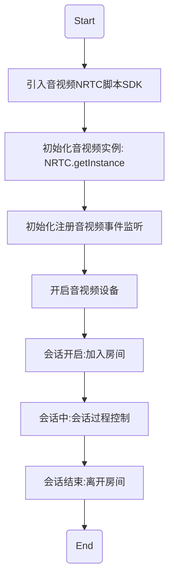
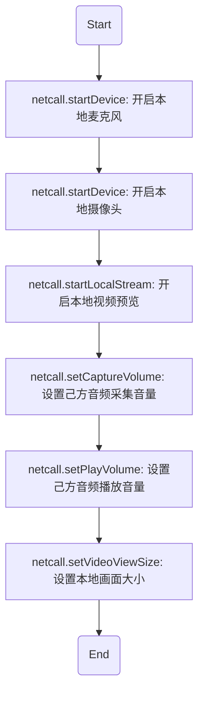
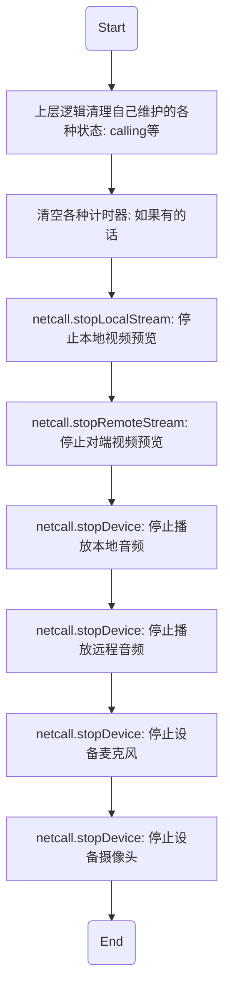

# <span id="NRTCWeb">实施音视频通话 SDK(NRTC) Web 开发指南</span>

## <span id="SDK概述">SDK 概述</span>

网易实时音视频独立 SDK (NRTC) 实现了一个简单的音视频通话接入机制，屏蔽复杂细节，提供简单的 API，方便开发者以简洁的方式接入音视频通话，并提供音视频互动直播功能。

此独立 SDK（以下简称 NRTC）不需要引入 IM 账号体系、登录登出等相关流程，具有更高的自由度。

NRTC 支持点对点的网络音视频通话和多人音视频会议。

## <span id="开发准备">开发准备</span>

联系您的网易云信商务经理获取实时音视频 SDK (NRTC)。NRTC 目前支持 chrome 58+、Firefox 57+。

* 如何检测当前浏览器对 webrtc 的支持程度，请[参考这里](/docs/product/通用/音视频文档类文件/web-compatibility)

> 请注意: 点对点和多人模式都是加入房间的概念，均采用以下流程进行音视频通话

## <span id="接入流程">接入流程</span>



## <span id="初始化音视频实例">初始化音视频实例</span>

```js
// SDK重命名
const Netcall = NRTC;
const netcall = Netcall.getInstance({
  container: document.getElementById('container'),
  remoteContainer: document.getElementById('remoteContainer'),
  // 是否开启日志打印
  debug: true
});
```

* 参数说明

| 参数名          | 类型 |                         说明 |
| :-------------- | ---: | ---------------------------: |
| container       |  dom |   播放自己视频画面的容器节点 |
| remoteContainer |  dom |       播放对方画面的容器节点 |
| debug           | bool | 是否开启日志打印，默认 false |

## <span id="初始化监听事件注册">初始化监听事件注册</span>

### <span id="用户加入房间通知">用户加入房间通知</span>

* API 介绍

  * 双人和多人通话中，加入房间后，如果有用户加入了当前房间，当前房间中的所有人都会收到该通知，做出相应处理

* 示例

```js
netcall.on('joinChannel', function(obj) {
  // 通知上层有其他用户加入了房间，上层做相应逻辑和UI处理
  console.log(obj.uid + ' 加入房间啦！！');
});
```

* 参数说明

obj 为通知消息对象

| obj 属性  |   类型 |             说明 |
| :-------- | -----: | ---------------: |
| uid       | string | 新加入同伴的 uid |
| channelId | number |    加入的房间 id |

* 具体方法说明

| 返回类型 |                         方法名 |                                                                                            说明 |
| :------- | -----------------------------: | ----------------------------------------------------------------------------------------------: |
| promise  |            netcall.startDevice |             [播放对方声音](/docs/product/音视频通话/SDK开发集成/Web开发集成/播放?#播放对方音频) |
| promise  |      netcall.startRemoteStream |       [预览对方视频画面](/docs/product/音视频通话/SDK开发集成/Web开发集成/播放?#预览远程视频流) |
| promise  | netcall.setVideoViewRemoteSize | [设置对方画面大小](/docs/product/音视频通话/SDK开发集成/Web开发集成/播放?#设置远程视频画面大小) |

### <span id="用户离开房间通知">用户离开房间通知</span>

* API 介绍
  * 多人通话中，加入房间后，如果有同伴离开房间，当前房间里的所有人都会收到该同伴离开会议的通知，开发者可以根据该通知做出相应处理
* 示例

```js
netcall.on('leaveChannel', function(obj) {
  // 通知上层有其他用户离开了会议，上层做相应逻辑和UI处理
  console.log(obj.uid + ' 离开房间了');
  // 停止预览该同伴的视频流
  netcall.stopRemoteStream({
    uid: obj.uid
  });
});
```

* 参数说明

obj 为通知消息对象

| obj 属性  |   类型 |           说明 |
| :-------- | -----: | -------------: |
| uid       | string | 离开同伴的 uid |
| channelId | number |  离开的房间 id |

* 具体方法说明

| 返回类型 |                   方法名 |                                                                                              说明 |
| :------- | -----------------------: | ------------------------------------------------------------------------------------------------: |
| promise  | netcall.stopRemoteStream | [停止预览对方视频画面](/docs/product/音视频通话/SDK开发集成/Web开发集成/播放?#停止预览远程视频流) |

### <span id="音量大小实时回调通知">音量大小实时回调通知</span>

* API 介绍

  * 点对点通话中，通过监听该方法，可以实时收到通话双方的音量大小值，做出相应 UI 展示
  * 多人通话中，加入多人房间后，通过监听该方法，可以实时收到当前房间中所有人的音量大小值，做出相应 UI 展示

* 示例

```js
netcall.on('audioVolumn', function(obj) {
  console.log('音量', obj);
});
```

* 参数说明

obj 为当前正在房间中所有人的音量对象，具体如下

| obj 属性           |  类型 |                   说明 |
| :----------------- | ----: | ---------------------: |
| obj['self']        |   obj |         自己的音量对象 |
| obj['self'].status | float |       自己的音量大小值 |
| obj['uidA']        |   obj |   账号`uidA`的音量对象 |
| obj['uidA'].status | float | 账号`uidA`的音量大小值 |

### <span id="收到用户媒体流的通知">收到用户媒体流的通知</span>

* API 介绍

  * 双人和多人通话中，加入房间后，可以通过该监听事件获取到其他新加入用户的媒体流通知，并作出相应处理
    * 展示对应用户的画面
    * 进行音视频录制等
  * 该事件抛出的目的也是为了方便用户做自定义操作，自己对媒体流的轨道信息做各种包装处理

* 示例

```js
netcall.on('remoteTrack', function(obj) {
  console.log('收到远程轨道信息', obj);
  // 音频：播放对方的音频
  if (obj.track.kind === 'audio') {
    // 播放对方声音
    netcall
      .startDevice({
        type: Netcall.DEVICE_TYPE_AUDIO_OUT_CHAT
      })
      .catch(function() {
        console.log('播放对方的声音失败');
      });
  }

  // 视频：展示对方的画面
  if (obj.track.kind === 'video') {
    // 预览加入的同学的视频流
    netcall.startRemoteStream({
      uid: obj.uid,
      node: document.getElementById('remoteContainer')
    });

    // 设置对方预览画面大小
    netcall.setVideoViewRemoteSize({
      uid: 'testUid',
      with: 500,
      height: 500,
      cut: true
    });
  }
});
```

* 参数说明

obj 为通知消息对象

| obj 属性  |   类型 |             说明 |
| :-------- | -----: | ---------------: |
| uid       | string | 新加入同伴的 uid |
| channelId | number |    加入的房间 id |

* 具体方法说明

| 返回类型 |                         方法名 |                                                                                            说明 |
| :------- | -----------------------------: | ----------------------------------------------------------------------------------------------: |
| promise  |            netcall.startDevice |             [播放对方声音](/docs/product/音视频通话/SDK开发集成/Web开发集成/播放?#播放对方音频) |
| promise  |      netcall.startRemoteStream |       [预览对方视频画面](/docs/product/音视频通话/SDK开发集成/Web开发集成/播放?#预览远程视频流) |
| promise  | netcall.setVideoViewRemoteSize | [设置对方画面大小](/docs/product/音视频通话/SDK开发集成/Web开发集成/播放?#设置远程视频画面大小) |

## <span id="加入房间">加入房间</span>

* API 介绍

  * 点对点和多人模式都是通过该方法来加入房间，加入房间后，可以通过事件监听来获取房间里其他人的信息

* 示例

```js
netcall.joinChannel(obj);
```

* 参数说明

obj 为加入房间需要传递的参数，具体如下

| obj 属性             |         类型 |                                     说明 |
| :------------------- | -----------: | ---------------------------------------: |
| obj['appkey']        |       string |                                   appkey |
| obj['cid']           |       string |                        即将加入的房间 id |
| obj['uid']           |       string |                           当前账号的 uid |
| obj['token']         |       string |                       appkey 的 token 值 |
| obj['role']          |       number |                   用户的角色(默认互动者) |
| obj['sessionMode']   |       string | 会话的类型(双人: 'p2p'、多人: 'meeting') |
| obj['wssArr']        | string/array |                                 网关地址 |
| obj['sessionConfig'] |       object |                                 会话配置 |

## <span id="开始音视频连接">开始音视频连接</span>

* API 介绍

  * 成功加入房间后，成功加入房间之后，即可开始音视频连接，一系列的步骤如下
  * 如果音视频连接失败，请检查是否已经加入了房间！
  * 请参照[收到用户媒体流的通知](#收到用户媒体流的通知)章节进行远程流媒体的渲染



* 示例

```js
const promise;
const netcall = this.netcall
const promise = Promise.resolve()

promise.then(function() {
  // 开启麦克风
  return netcall.startDevice({
    type: Netcall.DEVICE_TYPE_AUDIO_IN
  }).catch(function(err) {
    console.log('启动麦克风失败', err)
  })
})
.then(function() {
  // 设置采集音量
  netcall.setCaptureVolume(255)
  // 开启摄像头
  return netcall.startDevice({
	  type: Netcall.DEVICE_TYPE_VIDEO,
	  width: 640,
	  height: 480
	})
  .catch(function(err) {
    console.log('启动摄像头失败', err)
  })
})
.then(function() {
  // 设置本地预览画面大小
  netcall.setVideoViewSize({
    with: 500,
    height: 500,
    cut:true
  })
})
.then(function() {
  // 设置互动者角色
  netcall.changeRoleToPlayer()
  // 开启RTC连接
  console.log("开始webrtc")
  return netcall.startRtc()
})
.then(function() {
  console.log("webrtc连接成功")
})
.catch(function(err) {
  console.log('发生错误, 挂断通话')
  console.log(err)
  netcall.hangup()
})
```

## <span id="离开房间">离开房间</span>

* API 介绍
  * 如果不再参与会话，可通过该 API 离开房间，离开房间后，房间中的其他人将不再听到你的声音，也不再看到你的画面
* 示例

```js
netcall.leaveChannel().then(function(obj) {
  // 离开房间后的扫尾工作
});
```

* 特殊说明
  * 离开房间后，如果房间房间里还有人，还可以再继续加入该房间

## <span id="通话结束的清理工作">通话结束的清理工作</span>

* API 介绍
  * 通话结束后，需要手动做通话断开的清理工作，这里列一下最常见的清理步骤



| 返回类型 |                   方法名 |                                                                                            说明 |
| :------- | -----------------------: | ----------------------------------------------------------------------------------------------: |
| void     |  netcall.stopLocalStream |   [停止本地视频预览](/docs/product/音视频通话/SDK开发集成/Web开发集成/播放?#停止预览本地摄像头) |
| void     | netcall.stopRemoteStream |   [停止对端视频预览](/docs/product/音视频通话/SDK开发集成/Web开发集成/播放?#停止预览远程视频流) |
| void     |       netcall.stopDevice |         [停止设备麦克风](/docs/product/音视频通话/SDK开发集成/Web开发集成/采集?#关闭本地麦克风) |
| void     |       netcall.stopDevice |         [停止设备摄像头](/docs/product/音视频通话/SDK开发集成/Web开发集成/采集?#关闭本地摄像头) |
| void     |       netcall.stopDevice |         [停止播放本地音频](/docs/product/音视频通话/SDK开发集成/Web开发集成/播放?#播放本地音频) |
| void     |       netcall.stopDevice | [停止播放远程音频](/docs/product/音视频通话/SDK开发集成/Web开发集成/播放?#停止播放所有远程音频) |

* 示例

```js
// 停止本地视频预览
netcall.stopLocalStream();

// 停止对端视频预览
netcall.stopRemoteStream();

// 停止设备麦克风
netcall.stopDevice(Netcall.DEVICE_TYPE_AUDIO_IN);

// 停止设备摄像头
netcall.stopDevice(Netcall.DEVICE_TYPE_VIDEO);

// 停止播放本地音频
netcall.stopDevice(Netcall.DEVICE_TYPE_AUDIO_OUT_LOCAL);

// 停止播放对端音频
netcall.stopDevice(Netcall.DEVICE_TYPE_AUDIO_OUT_CHAT);
```

## <span id="采集">采集</span>

本章节主要介绍音视频数据采集相关的功能。默认是 SDK 接管采集

**清晰度档位支持**
清晰度设置默认是`480P`
支持的清晰度设置包括：`720P`、`540P`、`480P`、`360P`、`352*288`、`176*144`

**帧率档位支持**
帧率设置默认是`15fps`
支持的帧率设置包括：`5fps`、`10fps`、`15fps`、`20fps`、`25fps`

### <span id="获取指定设备列表">获取指定设备列表</span>

* API 介绍

  * 该方法能获取指定类型的设备列表，例如获取麦克风输入列表，摄像头输入列表等

* 示例

```js
const deviceType = Netcall.DEVICE_TYPE_AUDIO_IN;
netcall.getDevicesOfType(deviceType).then(function(obj) {
  console.log('音频设备列表:', obj);
});
```

* 参数说明

deviceType 为获取设备列表的类型值, [可选值见这里](/docs/product/音视频通话/SDK开发集成/Web开发集成/总体参数说明?#DeviceType)

### <span id="开启本地摄像头">开启本地摄像头</span>

* API 介绍
  * 在进行通话前或者过程中可以调用该方法来开启本地摄像头
* 示例

```js
netcall
  .startDevice({
    type: Netcall.DEVICE_TYPE_VIDEO,
    width: 640,
    height: 480,
    device: device
  })
  .then(function() {
    console.log('启动摄像头成功，可以进行预览啦');
  })
  .catch(function(err) {
    console.log('启动摄像头失败', err);
  });
```

* 参数说明

| 参数名 |   类型 |                                                                            说明 |
| :----- | -----: | ------------------------------------------------------------------------------: |
| type   | number |                                                    开启设备的类型, 当前为摄像头 |
| width  | number |                                                    以多少分辨率(宽度)开启摄像头 |
| height | number |                                                    以多少分辨率(高度)开启摄像头 |
| device | string | [可选]开启设备的设备 id, 通过设备列表获取, 不传该参数时默认开启设备列表的第一个 |

### <span id="关闭本地摄像头">关闭本地摄像头</span>

* API 介绍
  * 不再使用摄像头时，可以通过该方法关闭对摄像头的占用
* 示例

```js
netcall.stopDevice(Netcall.DEVICE_TYPE_VIDEO).then(function() {
  console.log('摄像头关闭成功');
});
```

### <span id="开启本地麦克风">开启本地麦克风</span>

* API 介绍
  * 在进行通话前或者过程中可以调用该方法来开启本地麦克风
* 示例

```js
netcall
  .startDevice({
    type: Netcall.DEVICE_TYPE_AUDIO_IN,
    device: device
  })
  .then(function() {
    console.log('启动麦克风成功');
  })
  .catch(function(err) {
    console.log('启动麦克风失败', err);
  });
```

* 参数说明

| 参数名 |   类型 |                                                                            说明 |
| :----- | -----: | ------------------------------------------------------------------------------: |
| type   | number |                                                    开启设备的类型, 当前为麦克风 |
| device | string | [可选]开启设备的设备 id, 通过设备列表获取, 不传该参数时默认开启设备列表的第一个 |

### <span id="关闭本地麦克风">关闭本地麦克风</span>

* API 介绍
  * 不再使用麦克风时，可以通过该方法关闭对麦克风的占用
* 示例

```js
netcall.stopDevice(Netcall.DEVICE_TYPE_AUDIO_IN).then(function() {
  console.log('麦克风关闭成功');
});
```

### <span id="设置本地音量采集大小">设置本地音量采集大小</span>

* API 介绍
  * 在通话的过程中，可以通过该方法动态调节音量采集的大小, 取值范围 0 - 255
* 示例

```js
netcall.setCaptureVolume(255);
```

## <span id="播放">播放</span>

该章节主要介绍和**播放**相关的功能。包括：**播放本地音频**、**播放本地视频**、**播放远端音频**、**播放远端视频**等功能，通过阅读本章节，您可以快速了解如何播放本地和远端的音频，如何调节音量大小，如何播放本地和远端视频，如何调节画面大小等。

### <span id="预览本地摄像头">预览本地摄像头</span>

* API 介绍

  * 成功开启摄像头之后，可以调用该方法进行本地预览

* 示例

```js
var node = document.getElementById('localVideo');
netcall.startLocalStream(node);
```

### <span id="停止预览本地摄像头">停止预览本地摄像头</span>

* API 介绍

  * 点对点通话结束后，可以关闭设备，停止预览画面和播放音频，可以通过该方法停止预览本地画面
  * 多人会议中，如果自己离开了会议，可以关闭设备，停止预览画面和播放音频，可以通过该方法停止预览本地画面

* 示例

```js
netcall.stopLocalStream();
```

* 参数说明

| 参数名 | 类型 |                      说明 |
| :----- | ---: | ------------------------: |
| node   |  dom | [可选]视频显示的 dom 容器 |

* 特殊说明
  * 如果是顶对点通话并且在实例化 Netcall 的时候已经传入了参数 `container`，此时可以不必再传入参数

### <span id="预览远程视频流">预览远程视频流</span>

* API 介绍

  * 加入房间后，可以在收到 `remoteTrack` 通知之后，开启对方的视频预览

* 示例

```js
var node = document.getElementById('localVideo');
var param = {
  uid: 'testUid',
  node: node
};
// 开启远程视频预览
netcall.startRemoteStream(param);
```

* 参数说明

param 对象包含了需要开启视频流的账号和对应的 dom 容器节点

| param 参数属性 |   类型 |                      说明 |
| :------------- | -----: | ------------------------: |
| uid            | string |          [可选]对方的 uid |
| node           |    dom | [可选]视频显示的 dom 容器 |

* 特殊说明
  * 点对点通话并且在实例化 Netcall 的时候已经传入了参数 `remoteContainer`，此时可以不必再传入参数 param
  * 多人会议中 param 为 `必传参数`

### <span id="停止预览远程视频流">停止预览远程视频流</span>

* API 介绍

  * 加入房间后，如果有参与者离开了房间，可以通过该方法停止预览对应目标的视频流画面
  * 多人房间中，如果自己离开了会议，可以通过该方法停止预览对应目标的视频流画面，这里不需要传入 uid 参数

* 示例

```js
var uid = 'testUid';
netcall.stopRemoteStream(uid);
```

* 参数说明

| 参数名 |   类型 |         说明 |
| :----- | -----: | -----------: |
| uid    | string | 目标账号 uid |

* 特殊说明
  * 多人房间中 uid 为必传参数，如果不传，将默认停止预览所有当前参与房间的远程视频流

### <span id="播放本地音频">播放本地音频</span>

* API 介绍

  * 成功开启麦克风之后，可以调用该方法播放本地麦克风捕获的音频

* 示例

```js
netcall
  .startDevice({
    type: Netcall.DEVICE_TYPE_AUDIO_OUT_LOCAL
  })
  .catch(function(err) {
    console.log('播放自己的声音失败', err);
  });
```

### <span id="停止播放本地音频">停止播放本地音频</span>

* API 介绍

  * 多人房间中，如果自己离开了房间，可以通过该方法停止播放本地音频

* 示例

```js
netcall.stopDevice(Netcall.DEVICE_TYPE_AUDIO_OUT_LOCAL);
```

### <span id="播放对方音频">播放对方音频</span>

* API 介绍

  * 通话开始后，如果对方成功开启了麦克风，我们可以通过该方法播放对方的声音

* 示例

```js
netcall
  .startDevice({
    type: Netcall.DEVICE_TYPE_AUDIO_OUT_CHAT
  })
  .catch(function() {
    console.log('播放对方的声音失败');
  });
```

### <span id="停止播放所有远程音频">停止播放所有远程音频</span>

* API 介绍

  * 多人房间中，如果自己离开了房间，可以通过该方法停止播放远程音频

* 示例

```js
netcall.stopDevice(Netcall.DEVICE_TYPE_AUDIO_OUT_CHAT);
```

### <span id="设置播放音量大小">设置播放音量大小</span>

* API 介绍

  * 多人房间中，可以通过该方法设置播放音量的大小，范围 0-255, 必填

* 示例

```js
netcall.setPlayVolume(255);
```

### <span id="设置本地视频画面大小">设置本地视频画面大小</span>

* API 介绍

  * 开启预览本地摄像头捕获的视频流后，可以通过该方法动态调节预览画面的大小

* 示例

```js
var param = {
  width: 500,
  height: 400,
  cut: true
};
netcall.setVideoViewSize(param);
```

* 参数说明

param 对象包含了需要设置预览视频画面大小和是否进行裁剪

| param 参数属性 |   类型 |               说明 |
| :------------- | -----: | -----------------: |
| width          | number | 需要预览画面的宽度 |
| height         | number | 需要预览画面的高度 |
| cut            |   bool |       是否进行裁剪 |

* 特殊说明
  * cut 设置为 false 时，设置的预览大小将按照捕获的原始视频宽高比进行等比缩放，会出现某一个方向撑不满容器，导致黑边的情况
  * cut 设置为 true 时，默认将原始画面按照 1:1 进行裁剪

### <span id="设置远程视频画面大小">设置远程视频画面大小</span>

* API 介绍

  * 收到远程流并启动预览之后，可以通过该方法动态调节预览画面的大小，用法和上面的 **设置本地视频画面大小** 一样

* 示例

```js
var param = {
  uid: 'testUid',
  width: 500,
  height: 400,
  cut: true
};
netcall.setVideoViewRemoteSize(param);
```

* 参数说明

param 对象包含了需要设置预览视频画面大小和是否进行裁剪

| param 参数属性 |   类型 |                           说明 |
| :------------- | -----: | -----------------------------: |
| uid            | string | 需要调节画面大小的目标账号 uid |
| width          | number |             需要预览画面的宽度 |
| height         | number |             需要预览画面的高度 |
| cut            |   bool |       是否进行裁剪(默认不裁剪) |

* 特殊说明
  * uid 设置为空或者不传时，将默认设置所有远程流的预览画面大小(多人房间中)
  * cut 设置为 false 时，设置的预览大小将按照捕获的原始视频宽高比进行等比缩放，会出现某一个方向撑不满容器，导致黑边的情况
  * cut 设置为 true 时，默认将原始画面按照 1:1 进行裁剪
