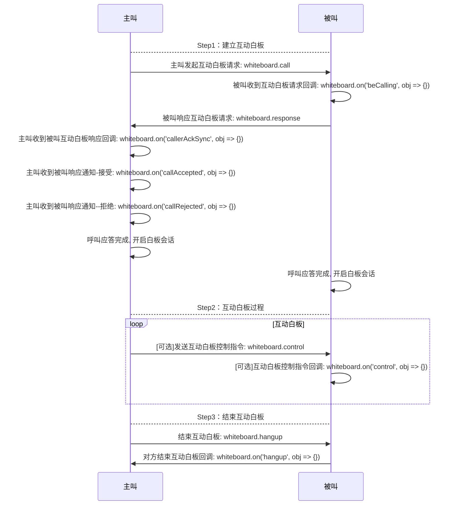
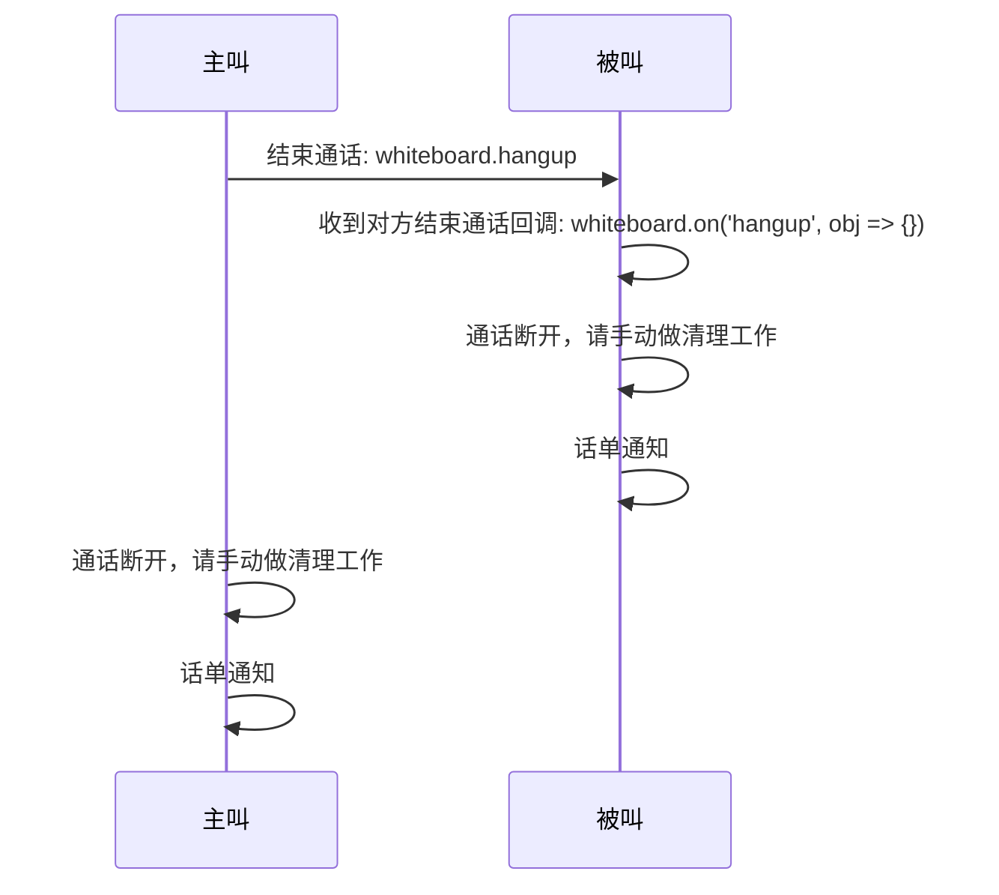

# <span id="双人互动白板">双人互动白板</span>

通过阅读本章节，您将快速了解双人互动白板的相关功能，并且能通过本章节中介绍的流程和接口快速搭建一个双人互动白板会话。

双人互动白板也称点对点互动白板，参与互动白板的共有两方，按照发起会话与接收会话区分为主叫与被叫角色。

SDK提供点对点互动白板从**发起会话**、**建立会话**、**会话互动**到**结束会话**整个过程的能力整个过程的能力，包括呼叫/接收、发送白板数据、结束白板等基础能力接口与异常流程控制与回调。 

考虑到白板使用场景与音频使用场景强关联，双人互动白板中包含语音通道（可选）更方便快捷满足简单白板的场景，需要注意的是语音通道全局只能有一个，并且与互动白板和互动直播功能互斥。

## <span id="双人白板接入流程">双人白板接入流程</span>



### <span id="主叫发起互动白板请求">主叫发起互动白板请求</span>

- API介绍:
  - 该方法可以立即向被叫方发起通话请求，对于移动native端，将发起持续呼叫
  - SDK 没有呼叫超时时间，开发者可根据自己的业务场景通过定时器设置呼叫超时时间，在被叫超时未接听时调用 `结束互动白板` 接口挂断该呼叫。

- 示例

```js
const pushConfig = {
  enable: true,
  needBadge: true,
  needPushNick: true,
  pushContent: '',
  custom: '测试自定义数据',
  pushPayload: '',
  sound: ''
}
const sessionConfig = {
    record: false
}
whiteboard.call({
    type: type,
    netcallType: WhiteBoard.CALL_TYPE_AUDIO,
    account: 'testAccount',
    pushConfig: pushConfig,
    sessionConfig: sessionConfig,
    webrtcEnable: true,
}).then(function(obj) {
  // 成功发起呼叫
  console.log('call success', obj)
}).catch(function(err) {
  // 被叫不在线
  if (err.code === 11001) {
    console.log('callee offline', err)
  }
})
// 设置超时计时器
let callTimer = setTimeout(function() {
  if (!whiteboard.callAccepted) {
    console.log('超时未接听, hangup')
    hangup()
  }
}, 1000 * 30)
```

- 参数说明

| 参数名|类型 |说明 |
| :-------- | --------:| --------:|
| type | number | 白板类型[]() |
| netcallType | number | 音视频类型[]() |
| webrtcEnable | bool| 音视频是否支持WebRTC方式接入，可选，默认为不开启 |
| account | string |对方账号 |
| pushConfig |object| 推送配置,[具体属性见这里](/docs/product/互动白板/SDK开发集成/Web开发集成/总体参数说明?#pushConfig) |
| sessionConfig| object|白板会话配置,[具体属性见这里](/docs/product/互动白板/SDK开发集成/Web开发集成/总体参数说明?#sessionConfig) |

- 特殊说明

SDK 没有呼叫超时时间，开发者可根据自己的业务场景通过定时器设置呼叫超时时间，在被叫超时未接听时调用 `结束互动白板` 接口挂断该呼叫。

### <span id="被叫收到互动白板请求回调">被叫收到互动白板请求回调</span>

- API介绍
  - 主叫发起通话请求后，被叫将收到呼叫通知，这时开发者可以依据一些自己的逻辑进行状态判断是否展示对应的UI和响应按钮
  - `请开发者自己做好呼叫超时处理`
- 示例

```js
// 是否被叫中
let beCalling = false
// 呼叫类型
let type = null
// 被叫信息
let beCalledInfo = null
// 是否正忙
let busy = false
// 开启监听
whiteboard.on('beCalling', function(obj) {
  console.log('on beCalling', obj)
  const channelId = obj.channelId
  // 被叫回应主叫自己已经收到了通话请求
  whiteboard.control({
    channelId,
    command: WebRTC.NETCALL_CONTROL_COMMAND_START_NOTIFY_RECEIVED
  })
  // 只有在没有通话并且没有被叫的时候才记录被叫信息, 否则通知对方忙并拒绝通话
  if (!whiteboard.calling && !beCalling) {
    type = obj.type
    beCalling = true
    beCalledInfo = obj
  } else {
    if (whiteboard.calling) {
      busy = whiteboard.notCurrentChannelId(obj)
    } else if (beCalling) {
      busy = beCalledInfo.channelId !== channelId
    }
    if (busy) {
      whiteboard.control({
        channelId,
        command: WebRTC.NETCALL_CONTROL_COMMAND_BUSY
      })
      // 拒绝通话
      whiteboard.response({
        accepted: false,
        beCalledInfo: obj
      })
    }
  }
})
```

- 参数说明
 obj 为收到的呼叫通知内容对象，这里只展示对开发者有用的几个字段，[具体信息见这里](/docs/product/互动白板/SDK开发集成/Web开发集成/总体参数说明?#被叫收到的呼叫通知内容)

| obj属性|类型 |说明 |
| :-------- | --------:| --------:|
| account | string |主叫account |
| type | number |主叫发起的通话类型（音频还是视频）|
| channelId | string| 该通呼叫通话的唯一id值，开发者可用于判断是否是同一通呼叫 |

### <span id="被叫响应互动白板请求">被叫响应互动白板请求</span>

- API介绍
  - 被叫收到呼叫请求后，可以选择接听或者拒绝，具体代码如下
- 示例

```js
// 接听
beCalling = false
const sessionConfig = {
    record: false
}
whiteboard.response({
  accepted: true,
  beCalledInfo: beCalledInfo,
  sessionConfig: sessionConfig
}).catch(function(err) {
  reject()
  console.log('接听失败', err)
})

// 拒绝
// 可以先通知对方自己忙, 拒绝的时候需要回传在 `beCalling` 事件里面接收到的对象
const beCalledInfo = beCalledInfo
whiteboard.control({
  channelId: beCalledInfo.channelId,
  command: WebRTC.NETCALL_CONTROL_COMMAND_BUSY
})
whiteboard.response({
  accepted: false,
  beCalledInfo
})
beCalledInfo = null
beCalling = false
```

- 参数说明

| 上面用到的参数名|类型 |说明 |
| :-------- | --------:| --------:|
| accepted | bool| 回应类型，接听、拒绝 |
| beCalledInfo | object|呼叫信息，必传，该值可以在 `beCalling` 回调事件中获取）|
| sessionConfig |object| 通话配置内容，具体信息请参考上面的主叫发起通话时的参数注解,[具体属性见这里](/docs/product/互动白板/SDK开发集成/Web开发集成/总体参数说明?#sessionConfig) |
| channelId |string| 该通呼叫通话的唯一id值 |
| command |number| 通话控制命令 |

### <span id="主叫收到被叫互动白板响应回调">主叫收到被叫互动白板响应回调</span>

- API介绍
  - 被叫根据自己的意愿做出呼叫应答之后，主叫将收到呼叫回应通知
- 示例

```js
// 被叫拒绝的通知
whiteboard.on('callRejected', function(obj) {
  console.log('on callRejected', obj)
  // 取消呼叫倒计时
  clearCallTimer()
  // 挂断
  hangup()
  // 做清理工作
  resetWhenHangup()
})

// 被叫接受的通知
whiteboard.on('callAccepted', function(obj) {
  // 缓存呼叫类型，后面开启音视频连接需要用到
  type = obj.type
  console.log('on callAccepted', obj)
  // 取消呼叫倒计时
  clearCallTimer()
  // 可以开启音视频连接操作。。。
})
```

- 参数说明

obj 为呼叫应答的回调通知对象

| obj属性|类型 |说明 |
| :-------- | --------:| --------:|
| account | string| 被叫账号 |
| type | number|音视频呼叫类型：音频、视频|

### <span id="呼入的通话已经被该帐号其他端处理回调">呼入的通话已经被该帐号其他端处理回调</span>

- API介绍
  - 当收到呼叫时，如果账号存在多端登录的情况并且其他端已经对该通呼叫做了应答，这时Web端回到提示通知：已被其他端处理
- 示例

```js
whiteboard.on('callerAckSync', function(obj) {
  console.log('其他端已经做了处理', obj)
})
```

- 参数说明

obj 为其他端已处理的回调对象

| obj属性|类型 |说明 |
| :-------- | --------:| --------:|
| timetag | string| 时间戳 |
| channelId | string|当前通话的唯一id值|
| type |number|通话类型：音频、视频|
| accepted | bool|其他端做出的应答：接受、拒绝|
| fromClientType | string|从什么类型的终端做出的应答：IOS、Android等|

### <span id="通话建立结果回调">通话建立结果回调</span>

- API介绍
    - 呼叫双方握手成功后，主叫被叫都会受到通话建立成功的回调通知来告知双方，这时双方即可开始建立白板会话

- 示例

```js
// 被叫接受的通知
whiteboard.on('callAccepted', function(obj) {
  console.log('on callAccepted', obj)
  // 取消呼叫倒计时
  clearCallTimer()
  // 可以开启白板会话操作。。。
})
```

### <span id="开启白板会话">开启白板会话</span>

- API介绍
  - 双方握手成功后，可以通过该方法开启白板会话连接

- 示例

```js
whiteboard.startSession()
    .then(function(obj){
        console.log('session Started', obj)
        if(whiteboard.sessionMode === 'p2p'){
            console.log('45s倒计时等待对方加入房间，若倒计时结束对方未加入房间，自动断开连接')
        }
        console.log('session Started', obj)
    })
    .catch(function(err) {
        console.log('session start failed', err)
        whiteboard.stopSession()
    })
```

### <span id='发送数据'>发送数据</span>

- API介绍
  - 白板互动中通过该方法向对端发送数据
- 示例
```js
whiteboard.sendData({
  data: 'message'
})
```
- 参数说明

| obj参数属性|类型 |说明 |
| :-------- | --------:| --------:|
| data | string| 待发送数据 |

- 特殊说明
  - 目前仅支持`字符串`格式的数据传输，如需传输对象，可使用JSON.stringify后发送

### <span id='接收数据'>接收数据</span>

- API介绍
  - 白板互动中通过该方法接收对端发送来的数据
- 示例
```js
whiteboard.on('data', function(msg){
  console.log(`接收到来自${msg.account}的信息：${msg.data}`)
})
```
- 绘制插件接入    
  - 用户可接入绘制插件，在收到数据后交由插件进行白板绘制，[接入参考](/docs/product/通用/Demo源码导读/在线教育Demo/Web源码导读?#白板绘制插件接入)


## <span id="会话过程控制">会话过程控制</span>

### <span id="发送互动白板控制指令">发送互动白板控制指令</span>

- API介绍

互动白板控制指令用于方便双方沟通信息，可以选择性使用。该指令通道使用云信 IM 消息通道，而不是互动白板数据通道。

常见指令如下

- 通知对方自己收到了呼叫
- 通知对方自己打开了音频麦克风
- 通知对方自己正忙
- 通知对方自己麦克风不可用

- 示例

```js
// 告诉发送方自己已经收到请求了（用于通知发送方开始播放提示音）
var param = {
  channelId: 1511182568418,
  command: WhiteBoard.CONTROL_COMMAND_START_NOTIFY_RECEIVED
}
whiteboard.control(param)
```

- 参数说明

| param参数属性|类型 |说明 |
| :-------- | --------:| --------:|
| channelId | number|当前会话的唯一id值|
| command | number|会话控制指令[具体值请参照这里](/docs/product/互动白板/SDK开发集成/Web开发集成/总体参数说明?#ControlType)|

### <span id="收到互动白板控制指令回调">收到互动白板控制指令回调</span>

- API介绍
  - 通话过程中通过监听该回调事件可以接收会话指令通知，做出相应处理

- 示例

```js
whiteboard.on('control', function(obj) {
  // 如果不是当前通话的指令, 直接丢掉
  if (whiteboard.notCurrentChannelId(obj)) {
    return
  }
  console.log('on control', obj)
})
```

- 参数说明

| obj参数属性|类型 |说明 |
| :-------- | --------:| --------:|
| channelId | number|当前会话的唯一id值|
| command | number|会话控制指令[具体值请参照这里](/docs/product/互动白板/SDK开发集成/Web开发集成/总体参数说明?#ControlType)|


## <span id="结束白板流程">结束白板流程</span>



### <span id="结束互动白板">结束互动白板</span>

- API介绍
  - 当不再继续通话时，可以调用该API结束当前通话，双方任意一方都可以进行该操作
  - 调用该方法之后，对方能立即收到挂断通知
  - 通话结束之后，请手动做通话断开的清理工作
- 示例

```js
whiteboard.hangup()
```

### <span id="对方结束互动白板回调">对方结束互动白板回调</span>

- API介绍
  - 点对点通话过程中，当对方挂断通话时，己方会立即收到对方挂断的通知，这时己方需要挂断通话，并做相应的[清理工作](/docs/product/互动白板/SDK开发集成/Web开发集成/互动白板流程点对点?#通话结束的清理工作)
- 示例

```js
whiteboard.on('hangup', function(obj) {
  console.log('on hangup', obj)
  // 判断需要挂断的通话是否是当前正在进行中的通话
  if (!beCalledInfo || beCalledInfo.channelId === obj.channelId) {
    // 清理工作
    resetWhenHangup()
  }
})
```

- 参数说明

obj 收到的挂断通知对象

| obj属性|类型 |说明 |
| :-------- | --------:| --------:|
| timetag | string| 时间戳 |
| channelId | string|当前通话的唯一id值|
| account |string|对方账号|
| type | number|挂断类型：0 为正常挂断，-1位异常挂断(超时等)|
