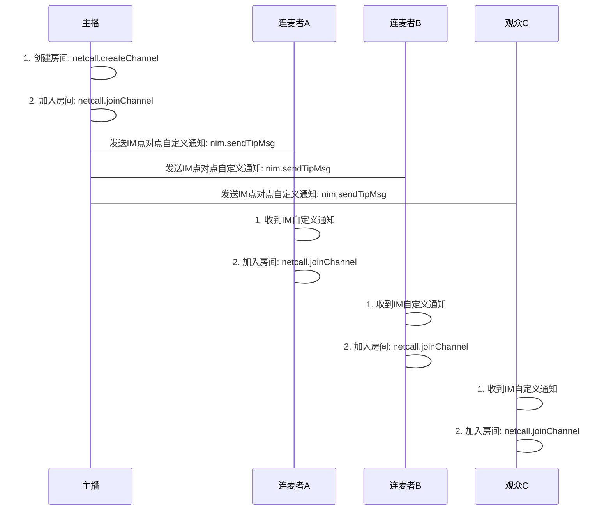
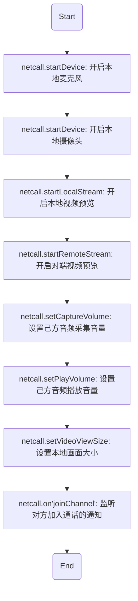
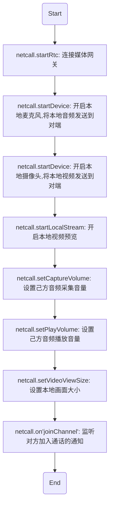

# <span id="互动直播接入流程">互动直播接入流程</span>

网易云通信提供简单的互动直播和连麦接口，只需要创建并加入互动房间即可以实现直播推流；连麦者使用相同的房间名加入互动房间即可以实现实时连麦互动。阅读该章节，您可以迅速完成一个最简单的互动直播房间的创建、加入，快速实现互动直播的功能。
在这里需要明确几个基本概念：

**房间**：互动直播房间与云通信音视频多人会议的房间概念一致，以房间名称为唯一标识。互动直播房间需要先创建成功后才能加入，当所有用户都离开房间后，可以复用该房间名重新创建。

**主播**：是互动直播房间的主用户，推流地址的指定者，直播的主画面源。主播需要首先加入房间。一个互动直播房间同时只能有一个主播。

**连麦者**：是互动直播房间的次用户，直播辅画面源，与主播加入同一房间，即能实现实时连麦互动，需要主播在房间时才能加入。

**观众**：互动直播中除了主播和连麦者，观看直播画面的其他用户。可以通过停止播放直播并加入互动房间转变为连麦者。

另外，理解网易云通信互动直播与音视频音视频通话的关系可以更好地帮助开发者快速集成：

**互动直播与多人音视频通话**：云通信互动直播基于多人音视频通话开发，通过将多人会议中用户的音视频数据处理后推送给视频流服务器实现直播和实时连麦。在功能的提供上，互动直播复用多人音视频接口，增加互动开关、推流地址指定与切换、直播角色指定等扩展设置。

## <span id="互动直播接入流程图">互动直播接入流程图</span>

互动直播多人房间暂不支持呼叫、推送和挂断等服务，只提供基本的创建、加入和离开房间接口。
目前呼叫方案可以使用`IM点对点自定义通知`发送呼叫

`请开发者自己做好呼叫超时处理`




## <span id="创建房间">创建房间</span>

- API介绍
  - 主播想要发起互动直播活动，必须先通过该方法创建一个互动直播房价

- 示例

```js
netcall.createChannel({
  //必填
  channelName: 'testChannelName',
  //可选
  custom: '测试自定义数据',
  // 是否支持WebRTC方式接入，可选，默认为不开启
  webrtcEnable: true
}).then(function(obj) {
  // 预定房间成功后的上层逻辑操作
  // eg: 初始化房间UI显示
  // eg: 加入房间
})
```

- 参数说明

| 参数名|类型 |说明 |
| :-------- | --------:| --------:|
| channelName | string| 房间房号，可以任意英文字母和数组的组合 |
| custom | string|扩展字段，在通话的创建和加入之间传递自定义的额外信息|
| webrtcEnable |bool|如果需要与 WebRTC 客户端互通，需要指定 WebRTC 兼容开关 `webrtcEnable` 为 true, **如果没有 WebRTC 客户端参与, 不要打开该开关**。|

- 特殊说明
  - 同一个房间名称，只在房间使用完并且房间被销毁（所有人都离开房间）以后才可以重复使用，开发者需要保证不会出现重复预订某房间名称而不使用的情况。
  - `请注意：创建房间的人必须是主播，且主播在创建房间后第一个加入该房间`，后面的连麦者和观众加入后，互动模式才能生效

## <span id="加入房间">加入房间</span>

- API介绍
  - 会议房间创建成功后，可以通过该API加入房间
  - 成功加入房间后，可以开启音视频通信,[请参照这里](#开启音视频连接)
- 示例

```js
const sessionConfig = {
  liveEnable: true, // 开启互动直播
  videoQuality: Netcall.CHAT_VIDEO_QUALITY_HIGH,
  videoFrameRate: Netcall.CHAT_VIDEO_FRAME_RATE_15,
  rtmpUrl: '推流地址', // 主播必填
  rtmpRecord: true, // 开启推流录制
  splitMode: WebRTC.LAYOUT_SPLITLATTICETILE,
  layout: '',
  highAudio: true
}
netcall.joinChannel({
  channelName: channelName, //必填
  type: Netcall.NETCALL_TYPE_VIDEO,
  liveEnable: true, //开启互动直播
  sessionConfig: sessionConfig
}).then(function(obj) {
  // 加入房间成功后的上层逻辑操作
  // eg: 开启摄像头
  // eg: 开启麦克风
  // eg: 开启本地流
  // eg: 设置音量采集、播放
  // eg: 设置视频画面尺寸等等，具体请参照p2p呼叫模式
})
```

- 参数说明

| 参数名|类型 |说明 |
| :-------- | --------:| --------:|
| channelName | string| 会议房号，可以任意英文字母和数组的组合 |
| type | number|会议通话类型，音频、视频|
| liveEnable | bool|是否开启互动直播，默认不开|
| sessionConfig |object|会话配置, 每次通话会伴随着一次会话, 可以对此次会话进行一些配置,[具体属性见这里](/docs/product/互动直播/SDK开发集成/Web开发集成/总体参数说明?#sessionConfig互动直播)|
| sessionConfig.liveEnable | bool|开启互动直播功能|
| sessionConfig.rtmpUrl | string|推流地址，主播必填，`连麦者不要填写`|
| sessionConfig.rtmpRecord | bool|是否开启推流录制，默认不开|
| sessionConfig.splitMode | number|主播和连麦者的推流布局模式，[具体值参照这里](/docs/product/互动直播/SDK开发集成/Web开发集成/总体参数说明?#SplitMode)|
| sessionConfig.videoQuality | number|视频分辨率，[具体值参照这里](/docs/product/互动直播/SDK开发集成/Web开发集成/总体参数说明?#videoQuality)|
| sessionConfig.videoFrameRate | number|视频帧率，[具体值参照这里](/docs/product/互动直播/SDK开发集成/Web开发集成/总体参数说明?#videoFrameRate)|

## <span id="开启音视频连接">开启音视频连接</span>

### <span id="开启音视频连接Agent">音视频连接（PC Agent）</span>

- API介绍
    - 成功加入房间之后，即可开始音视频连接，一系列的步骤如下



- 示例

```js
// 缓存netcall实例
const netcall = this.netcall
// 开启麦克风
netcall.startDevice({
  type: Netcall.DEVICE_TYPE_AUDIO_IN
})
.then(function() {
  // 通知对方自己开启了麦克风
  netcall.control({
    command: Netcall.NETCALL_CONTROL_COMMAND_NOTIFY_AUDIO_ON
  })
})
.catch(function(err) {
  console.log('启动麦克风失败')
  console.log(err)
})

// 开启摄像头
netcall.startDevice({
  type: Netcall.DEVICE_TYPE_VIDEO,
  width: 640,
  height: 480
})
.then(function() {
  // 通知对方自己开启了摄像头
  netcall.control({
    command: Netcall.NETCALL_CONTROL_COMMAND_NOTIFY_VIDEO_ON
  })
})
.catch(function(err) {
  // 通知对方自己的摄像头不可用
  netcall.control({
    command: Netcall.NETCALL_CONTROL_COMMAND_SELF_CAMERA_INVALID
  })
  console.log('启动摄像头失败')
    console.error(err)
})

// 开启本地视频预览
netcall.startLocalStream()

// 设置本地音量采集大小, 该API可以在通话过程中动态调用调整自己的音量采集大小
netcall.setCaptureVolume(255)

// 设置本地音量播放大小, 该API可以在通话过程中动态调用调整自己的音量播放大小(即自己听对端的音量)
netcall.setPlayVolume(255)

// 设置本地视频画面大小
netcall.setVideoViewSize({
  width: 500,
  height: 500,
  cut: true
})

// 在回调里监听对方加入通话，并显示对方的视频画面
netcall.on('joinChannel', function(obj) {
  console.log('user join', obj)
  // 播放对方声音
  netcall.startDevice({
    type: Netcall.DEVICE_TYPE_AUDIO_OUT_CHAT
  })
  .catch(function(err) {
    console.log('播放对方的声音失败')
    console.error(err)
  })
  // 预览对方视频画面
  netcall.startRemoteStream({
    account: obj.account,
    node: document.getElementById('remoteContainer')
  })
  // 设置对方预览画面大小
  netcall.setVideoViewRemoteSize({
    account: 'testAccount',
    with: 500,
    height: 500,
    cut:true
  })
})
```

- 具体方法说明

| 返回类型|方法名 |说明 |
| :-------- | --------:| --------:|
| promise | netcall.startDevice| [开启本地麦克风](/docs/product/互动直播/SDK开发集成/Web开发集成/采集?#开启本地麦克风) |
| promise | netcall.startDevice| [开启本地摄像头](/docs/product/互动直播/SDK开发集成/Web开发集成/采集?#开启本地摄像头) |
| promise | netcall.startLocalStream| [开启本地视频预览](/docs/product/互动直播/SDK开发集成/Web开发集成/播放?#预览本地摄像头) |
| promise | netcall.setCaptureVolume| [设置己方音频采集音量](/docs/product/互动直播/SDK开发集成/Web开发集成/采集?#设置音量采集大小) |
| promise | netcall.setPlayVolume| [设置己方音频播放音量](/docs/product/互动直播/SDK开发集成/Web开发集成/播放?#设置播放音量大小) |
| promise | netcall.setVideoViewSize| [设置本地画面大小](/docs/product/互动直播/SDK开发集成/Web开发集成/播放?#设置本地视频画面大小) |
| promise | netcall.startDevice| [播放对方声音](/docs/product/互动直播/SDK开发集成/Web开发集成/播放?#播放对方音频) |
| promise | netcall.startRemoteStream| [预览对方视频画面](/docs/product/互动直播/SDK开发集成/Web开发集成/播放?#预览远程视频流) |
| promise | netcall.setVideoViewRemoteSize| [设置对方画面大小](/docs/product/互动直播/SDK开发集成/Web开发集成/播放?#设置远程视频画面大小) |

### <span id="开启音视频连接WebRTC">音视频连接（WebRTC）</span>

- API介绍
    - 成功加入房间之后，即可开始音视频连接，一系列的步骤如下



- 示例

```js
const netcall = this.netcall

netcall.startRtc().then(function() {
  // 开启麦克风
  return netcall.startDevice({
    type: Netcall.DEVICE_TYPE_AUDIO_IN
  }).catch(function(err) {
    console.log('启动麦克风失败')
    console.error(err)
  })
})
.then(function() {
  // 设置采集音量
  netcall.setCaptureVolume(255)
  // 开启摄像头
  return netcall.startDevice({
	  type: Netcall.DEVICE_TYPE_VIDEO,
	  width: 640,
	  height: 480
	})
  .catch(function(err) {
    console.log('启动摄像头失败')
    console.error(err)
  })
})
.then(function() {
  // 设置本地预览画面大小
  netcall.setVideoViewSize({
    with: 500,
    height: 500,
    cut:true
  })
})
.then(function() {
  // 主播、连麦者请设置互动者角色
  netcall.changeRoleToPlayer()
  // 开启RTC连接
  console.log("开始webrtc")
  netcall.startRtc()
})
.then(function() {
  console.log("webrtc连接成功")
})
.catch(function(err) {
  console.log('发生错误, 挂断通话')
  console.log(err)
  netcall.hangup()
})

// 在回调里监听对方加入通话，并显示对方的视频画面
netcall.on('joinChannel', function(obj) {
  console.log('user join', obj)
  // 播放对方声音
  netcall.startDevice({
    type: Netcall.DEVICE_TYPE_AUDIO_OUT_CHAT
  }).catch(function(err) {
    console.log('播放对方的声音失败')
    console.error(err)
  })
  // 预览对方视频画面
  netcall.startRemoteStream({
    account: obj.account,
    node: document.getElementById('remoteContainer')
  })
  // 设置对方预览画面大小
  netcall.setVideoViewRemoteSize({
    account: 'testAccount',
    with: 500,
    height: 500,
    cut:true
  })
})
```

- 具体方法说明

| 返回类型|方法名 |说明 |
| :-------- | --------:| --------:|
| promise | netcall.startRtc | 连接媒体网关 |
| promise | netcall.startDevice| [开启本地麦克风](/docs/product/互动直播/SDK开发集成/Web开发集成/采集?#开启本地麦克风) |
| promise | netcall.startDevice| [开启本地摄像头](/docs/product/互动直播/SDK开发集成/Web开发集成/采集?#开启本地摄像头) |
| promise | netcall.startLocalStream| [开启本地视频预览](/docs/product/互动直播/SDK开发集成/Web开发集成/播放?#预览本地摄像头) |
| promise | netcall.setCaptureVolume| [设置己方音频采集音量](/docs/product/互动直播/SDK开发集成/Web开发集成/采集?#设置音量采集大小) |
| promise | netcall.setPlayVolume| [设置己方音频播放音量](/docs/product/互动直播/SDK开发集成/Web开发集成/播放?#设置播放音量大小) |
| promise | netcall.setVideoViewSize| [设置本地画面大小](/docs/product/互动直播/SDK开发集成/Web开发集成/播放?#设置本地视频画面大小) |
| promise | netcall.startDevice| [播放对方声音](/docs/product/互动直播/SDK开发集成/Web开发集成/播放?#播放对方音频) |
| promise | netcall.startRemoteStream| [预览对方视频画面](/docs/product/互动直播/SDK开发集成/Web开发集成/播放?#预览远程视频流) |
| promise | netcall.setVideoViewRemoteSize| [设置对方画面大小](/docs/product/互动直播/SDK开发集成/Web开发集成/播放?#设置远程视频画面大小) |

- 特殊说明
  - 这一系列的链式 Promise 调用，看起来非常不友好，如何让写法更加优雅呢，请[参考这里](/docs/product/通用/音视频文档类文件/web-pipe)

## <span id="离开房间">离开房间</span>

- API介绍
  - 如果不再参与互动直播，可以通过该方法离开房间，离开房间后，房间中的其他人将不再听到你的声音，也不再看到你的画面
  - 离开会议后，请做相应的清理工作
- 示例

```js
netcall.leaveChannel().then(function(obj) {
  // 离开房间后，开发者自己业务的扫尾工作
})
```

- 特殊说明
  - 主播离开房间后，第三方拉流会结束，将不再拉到新的流
  - 主播离开房间后，如果房间还有人，主播还可以继续加入该房间，再重新开启互动直播模式
  - 观众和连麦者离开房间后，如果主播还在房间里，观众和连麦者还可以继续加入该房间


## <span id="用户加入房间通知">用户加入房间通知</span>

- API介绍
  - 加入房间后，如果有用户加入了当前房间，当前房间中的所有人都会收到该通知，做出相应处理
    - 开启新加入的用户的视频画面显示

- 示例

```js
netcall.on('joinChannel', function (obj) {
  // 通知上层有其他用户加入了房间，上层做相应逻辑和UI处理
  // 这里可以预览加入的同学的视频流
  // 播放对方声音
  netcall.startDevice({
    type: Netcall.DEVICE_TYPE_AUDIO_OUT_CHAT
  }).catch(function() {
    console.log('播放对方的声音失败')
  })

  // 预览加入的同学的视频流
  netcall.startRemoteStream({
    account: obj.account,
    node: document.getElementById('remoteContainer')
  })

  // 设置对方预览画面大小
  netcall.setVideoViewRemoteSize({
    account: 'testAccount',
	with: 500,
	height: 500,
	cut:true
  })
})
```

- 参数说明

obj 为通知消息对象

| obj属性|类型 |说明 |
| :-------- | --------:| --------:|
| account | string| 新加入同伴的accid |
| channelId | number|加入的房间id|

- 具体方法说明

| 返回类型|方法名 |说明 |
| :-------- | --------:| --------:|
| promise | netcall.startDevice|[播放对方声音](/docs/product/互动直播/SDK开发集成/Web开发集成/播放?#播放对方音频)|
| promise | netcall.startRemoteStream|[预览对方视频画面](/docs/product/互动直播/SDK开发集成/Web开发集成/播放?#预览远程视频流)|
| promise | netcall.setVideoViewRemoteSize|[设置对方画面大小](/docs/product/互动直播/SDK开发集成/Web开发集成/播放?#设置远程视频画面大小)|

## <span id="用户离开房间通知">用户离开房间通知</span>

- API介绍
  - 加入房间后，如果有同伴离开房间，当前房间里的所有人都会收到该同伴离开会议的通知，开发者可以根据该通知做出相应处理
- 示例

```js
netcall.on('leaveChannel', function (obj) {
  // 通知上层有其他用户离开了会议，上层做相应逻辑和UI处理

  // 停止预览该同伴的视频流
  netcall.stopRemoteStream({
    account: obj.account
  })
})
```

- 参数说明

obj 为通知消息对象

| obj属性|类型 |说明 |
| :-------- | --------:| --------:|
| account | string| 离开同伴的accid |
| channelId | number|离开的房间id|

- 具体方法说明

| 返回类型|方法名 |说明 |
| :-------- | --------:| --------:|
| promise | netcall.stopRemoteStream|[停止预览对方视频画面](/docs/product/互动直播/SDK开发集成/Web开发集成/播放?#停止预览远程视频流)|
