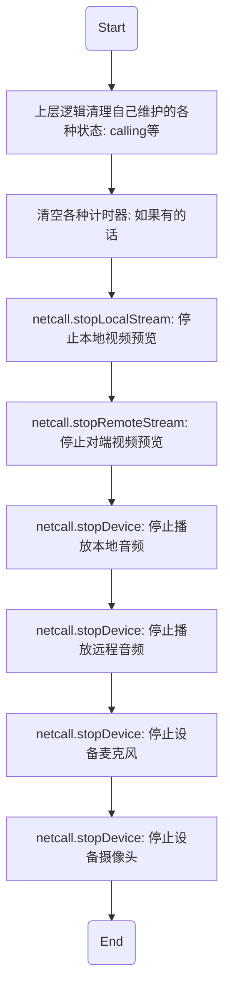

# <span id="初始化">初始化</span>

音视频的接入需要依赖IM的账号系统，所以音视频的初始化需要依赖IM实例，这里需要首先初始化IM，再初始化音视频

## <span id="初始化IM">初始化IM</span>

初始化IM, 完成IM的登录连接操作 [请参照IM初始化章节](/docs/product/IM即时通讯/SDK开发集成/Web开发集成/初始化)

**请注意**：`IM连接成功后`方可进行音视频通话，否则音视频通话会失败

## <span id="初始化音视频">初始化音视频</span>

PC Agent 和 WebRTC 的初始化方式不太一样，这里分别举例

### <span id="初始化音视频(Agent)">初始化音视频(PC Agent)</span>

以下是示例代码

```js
const netcall = Netcall.getInstance({
  kickLast: false,
  nim: nim,
  container: document.getElementById('container'),
  remoteContainer: document.getElementById('remoteContainer'),
  mirror: true,
  mirrorRemote: true,
})
```

- 参数说明

| 参数名|类型 |说明 |
| :-------- | --------:| --------:|
| kickLast | bool| 是否踢掉上次的通话, 默认 false |
| nim | object| 音视频通话是基于 IM 的, 需要传入 `NIM 初始化后的实例` |
| container | dom| 播放自己视频画面的容器节点 |
| remoteContainer | dom |播放对方画面的容器节点 |
| mirror| bool | 是否对自己的画面进行镜像处理, 默认 false, 一般来讲请将此参数设置为 true（既自己看自己是反项的） |
| mirrorRemote| bool| 是否对对方的画面进行镜像处理, 默认 false |

#### <span id="初始化">初始化信令</span>

Web 音视频通话依赖于 PC 插件, 所以在使用任何音视频通话功能之前, 需要先建立和 PC 插件之间的信令通道, 示例代码如下

```js
var signalInited = false
// 信令通道初始化完毕之后, 开发者可以启用音视频通话相关的 UI, 比如说展示呼叫别人的按钮
// 信令通道初始化失败的时候, 请展示错误并禁用所有音视频通话相关的 UI
netcall.initSignal().then(function() {
  console.log('signalInited')
  signalInited = true
}).catch(function(err) {
  console.log('initSignalError', err)
  signalInited = false
})
// 当信令通道断开时, 会触发 signalClosed 事件
netcall.on('signalClosed', function() {
  console.log('on signalClosed')
  signalInited = false
  netcall.hangup()
})
// 初始化过程中会通过 devices 事件回传所有的设备列表
netcall.on('devices', function(obj) {
  console.log('on devices', obj)
})
```

#### <span id="停止信令">停止信令</span>

当音视频通话结束之后, 需要停止信令通道, 然后禁用所有音视频通话相关的 UI, 示例代码如下

```js
netcall.stopSignal()
```

### <span id="初始化音视频(WebRTC)">初始化音视频(WebRTC)</span>

以下是示例代码

```js
// SDK重命名
const Netcall = WebRTC
const netcall = Netcall.getInstance({
  nim: nim,
  container: document.getElementById('container'),
  remoteContainer: document.getElementById('remoteContainer'),
  // 是否开启日志打印
  debug: true
})
```

- 参数说明

| 参数名|类型 |说明 |
| :-------- | --------:| --------:|
| nim | object| 音视频通话是基于 IM 的, 需要传入 `NIM 初始化后的实例` |
| container | dom| 播放自己视频画面的容器节点 |
| remoteContainer | dom |播放对方画面的容器节点 |
| debug| bool | 是否开启日志打印，默认 false |

### <span id="初始注册事件监听">初始注册事件监听</span>

在初始化音视频通话之后, 在进行音视频通话之前, 请先注册监听一些音视频通话通知事件, 基本上所有的音视频通话操作都是异步的, 而且这些操作会触发音视频通话的某些事件, 具体事件会在各个操作里面详细介绍.

#### <span id="用户加入房间通知">用户加入房间通知</span>

- API介绍
  - 多人通话中，加入多人房间后，如果有用户加入了当前房间，当前房间中的所有人都会收到该通知，做出相应处理
    - 开启新加入的用户的视频画面显示

- 示例

```js
netcall.on('joinChannel', function (obj) {
  // 通知上层有其他用户加入了房间，上层做相应逻辑和UI处理
  // 这里可以预览加入的同学的视频流
  // 播放对方声音
  netcall.startDevice({
    type: Netcall.DEVICE_TYPE_AUDIO_OUT_CHAT
  }).catch(function() {
    console.log('播放对方的声音失败')
  })

  // 预览加入的同学的视频流
  netcall.startRemoteStream({
    account: obj.account,
    node: document.getElementById('remoteContainer')
  })

  // 设置对方预览画面大小
  netcall.setVideoViewRemoteSize({
    account: 'testAccount',
	with: 500,
	height: 500,
	cut:true
  })
})
```

- 参数说明

obj 为通知消息对象

| obj属性|类型 |说明 |
| :-------- | --------:| --------:|
| account | string| 新加入同伴的accid |
| channelId | number|加入的房间id|

- 具体方法说明

| 返回类型|方法名 |说明 |
| :-------- | --------:| --------:|
| promise | netcall.startDevice|[播放对方声音](/docs/product/互动直播/SDK开发集成/Web开发集成/播放?#播放对方音频)|
| promise | netcall.startRemoteStream|[预览对方视频画面](/docs/product/互动直播/SDK开发集成/Web开发集成/播放?#预览远程视频流)|
| promise | netcall.setVideoViewRemoteSize|[设置对方画面大小](/docs/product/互动直播/SDK开发集成/Web开发集成/播放?#设置远程视频画面大小)|

#### <span id="用户离开房间通知">用户离开房间通知</span>

- API介绍
  - 多人通话中，加入房间后，如果有同伴离开房间，当前房间里的所有人都会收到该同伴离开会议的通知，开发者可以根据该通知做出相应处理
- 示例

```js
netcall.on('leaveChannel', function (obj) {
  // 通知上层有其他用户离开了会议，上层做相应逻辑和UI处理

  // 停止预览该同伴的视频流
  netcall.stopRemoteStream({
    account: obj.account
  })
})
```

- 参数说明

obj 为通知消息对象

| obj属性|类型 |说明 |
| :-------- | --------:| --------:|
| account | string| 离开同伴的accid |
| channelId | number|离开的房间id|

- 具体方法说明

| 返回类型|方法名 |说明 |
| :-------- | --------:| --------:|
| promise | netcall.stopRemoteStream|[停止预览对方视频画面](/docs/product/互动直播/SDK开发集成/Web开发集成/播放?#停止预览远程视频流)|

#### <span id="通话中收到远端的控制指令">通话中收到远端的控制指令</span>

- API介绍
  - 通话过程中，可以通过监听该通知接口来接收各种通话指令的通知，做出相应处理

- 示例

```js
netcall.on('control', function(obj) {
  console.log('收到指令', obj)
})
```

- 参数说明

obj 为指令通知对象

| param属性|类型 |说明 |
| :-------- | --------:| --------:|
| channelId | number|需要发送指令的房间id|
| command | number| 指令类型,[具体值请参照这里](/docs/product/互动直播/SDK开发集成/Web开发集成/总体参数说明?#ControlType) |

#### <span id="音量大小实时回调通知">音量大小实时回调通知</span>

- API介绍
  - 点对点通话中，通过监听该方法，可以实时收到通话双方的音量大小值，做出相应UI展示
  - 多人通话中，加入多人房间后，通过监听该方法，可以实时收到当前房间中所有人的音量大小值，做出相应UI展示

- 示例

```js
netcall.on('audioVolumn', function(obj) {
  console.log('音量', obj)
})
```

- 参数说明

obj 为当前正在房间中所有人的音量对象，具体如下

| obj属性|类型 |说明 |
| :-------- | --------:| --------:|
| obj['self'] |obj|自己的音量对象|
| obj['self'].status |float|自己的音量大小值|
| obj['accountA'] |obj|账号`accountA`的音量对象|
| obj['accountA'].status |float|账号`accountA`的音量大小值|

#### <span id="设备状态变化通知">设备状态变化通知</span>

- API介绍
  - 插拔摄像头时，会触发该回调通知事件，这时开发者可以调用方法检测新的设备状态

- 示例

```js
netcall.on('deviceStatus', function(obj) {
    console.log('设备状态发生变化', obj)

    // 检查摄像头
    netcall.getDevicesOfType(WebRTC.DEVICE_TYPE_VIDEO).then(function (devices) {
        console.log('摄像头', devices)
    })

    // 检查麦克风
    netcall.getDevicesOfType(WebRTC.DEVICE_TYPE_AUDIO_IN).then(function (devices) {
        console.log('麦克风', devices)
    })
})
```

## <span id="音视频清理">音视频清理</span>

音视频网络通话相关功能调用结束后（即通话结束后，ps. 5.6.0版本开始的sdk为了减轻开发者工作，在互动直播结束后，即离开房间，开发者调用完leaveChannel接口即可，sdk内部会做一系列的清除工作，无需执行下面的流程），需要在SDK清理前，主动清理音视频功能。这里列一下最常见的清理步骤



| 返回类型|方法名 |说明 |
| :-------- | --------:| --------:|
| void | netcall.stopLocalStream|[停止本地视频预览](/docs/product/互动直播/SDK开发集成/Web开发集成/播放?#停止预览本地摄像头)|
| void | netcall.stopRemoteStream|[停止对端视频预览](/docs/product/互动直播/SDK开发集成/Web开发集成/播放?#停止预览远程视频流)|
| void | netcall.stopDevice|[停止设备麦克风](/docs/product/互动直播/SDK开发集成/Web开发集成/采集?#关闭本地麦克风)|
| void | netcall.stopDevice|[停止设备摄像头](/docs/product/互动直播/SDK开发集成/Web开发集成/采集?#关闭本地摄像头)|
| void | netcall.stopDevice|[停止播放本地音频](/docs/product/互动直播/SDK开发集成/Web开发集成/播放?#播放本地音频)|
| void | netcall.stopDevice|[停止播放远程音频](/docs/product/互动直播/SDK开发集成/Web开发集成/播放?#停止播放所有远程音频)|

- 示例

```js
// 清除上层逻辑自己维护的各种状态
clear()

// 停止本地视频预览
netcall.stopLocalStream()

// 停止对端视频预览
netcall.stopRemoteStream()

// 停止设备麦克风
netcall.stopDevice(Netcall.DEVICE_TYPE_AUDIO_IN)

// 停止设备摄像头
netcall.stopDevice(Netcall.DEVICE_TYPE_VIDEO)

// 停止播放本地音频
netcall.stopDevice(Netcall.DEVICE_TYPE_AUDIO_OUT_LOCAL)

// 停止播放对端音频
netcall.stopDevice(Netcall.DEVICE_TYPE_AUDIO_OUT_CHAT)
```