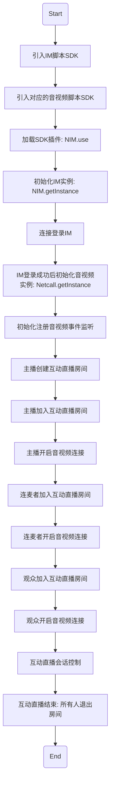

# 互动直播总体流程图

```mermaid
graph TB
A(Start) --> B[引入IM脚本SDK]
B --> C[引入对应的音视频脚本SDK]
C --> D[加载SDK插件: NIM.use]
D --> E[初始化IM实例: NIM.getInstance]
E --> F[连接登录IM]
F --> G[IM登录成功后初始化音视频实例: Netcall.getInstance]
G --> H[初始化注册音视频事件监听]
H --> I[主播创建互动直播房间]
I --> J[主播加入互动直播房间]
J --> K[主播开启音视频连接]
K --> L[连麦者加入互动直播房间]
L --> M[连麦者开启音视频连接]
M --> N[观众加入互动直播房间]
N --> O[观众开启音视频连接]
O --> P[互动直播会话控制]
P --> Q[互动直播结束: 所有人退出房间]
Q --> R(End)
```