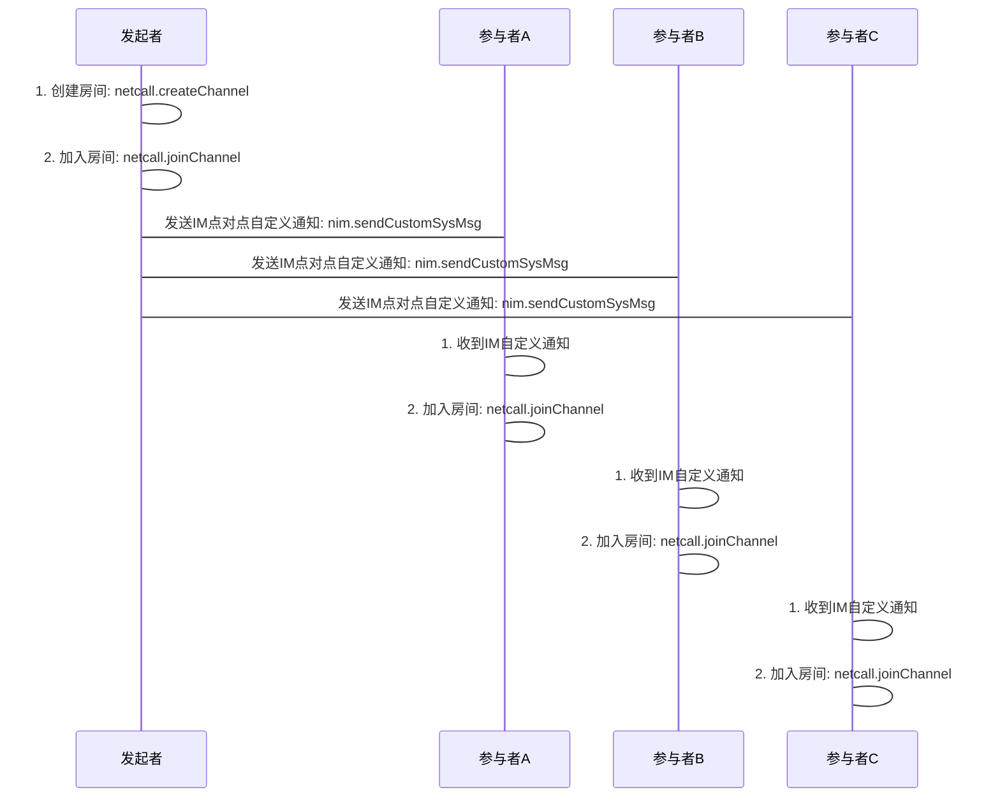

# <span id="多人音视频通话">多人音视频通话</span>

本章节介绍多人实时音视频通话的相关功能。多人实时音视频通话顾名思义是支持多个人同时进行实时音视频通话，可以选择纯音频模式，或音视频模式。在这里需要明确几个概念：

**房间：**房间就是用户进行多人实时音视频通话的地方，房间以房间名称为唯一标识，多人房间需要先创建成功后才能加入，当所有用户都离开房间后，可以复用该房间名重新创建。

**互动者：**互动者是指在多人通话时可以参与互动，可以发言的人，这些用户可以发送上行的音频或视频数据，也可以接收其他互动者下行的音频或视频数据。

**观众：**观众是指在多人通话时只可以观看的人，没有发言的权限，这些用户只可以接收互动者下行的音频或视频数据，不可以发送上行音频或视频数据。(受限于微信小程序，请自行控制 `live-pusher` 组件是否推流，SDK只将用户身份上报网关，具体身以网关是否收到媒体数据为准)


## <span id="多人音视频通话流程图">多人音视频通话流程图</span>

与点对点通话的流程不同，多人房间暂不支持呼叫、推送和挂断等服务，只提供基本的创建、加入和离开房间接口。目前呼叫方案可以使用`IM点对点自定义通知`发送呼叫

`请开发者自己做好呼叫超时处理`



## <span id="创建房间">创建房间</span>

* API 介绍

  * 要想发起多人通话，需要先创建一个多人房间，本人和其他人才能加入房间。

* 示例

```js
netcall.createChannel({
  channelName: 'channelName' //必填
}).then(function() {
  console.log('创建房间成功')
  // 创建房间成功后的上层逻辑操作
  // eg: 初始化房间UI显示
  // eg: 加入房间
})
```

* 参数说明

| 参数名       |   类型 | 说明 |
| :----------- | -----: | ----: |
| channelName  | string | 房间房号，可以任意英文字母和数组的组合 |

* 特殊说明
  * 同一个房间名称，只在房间使用完并且房间被销毁（所有人都离开房间）以后才可以重复使用，开发者需要保证不会出现重复预订某房间名称而不使用的情况。

## <span id="加入房间">加入房间</span>

* API 介绍
  * 多人房间创建成功后，可以通过该方法加入房间
* 示例

```js
// 清先设置live-puhser组件的camera和micro的状态，保证两者状态与mode统一
netcall
  .joinChannel({
    channelName: 'testChannelName' //必填，请确保此房间已被创建
    mode: 0, // 模式，0音视频，1纯音频，2纯视频，3静默
    role: 0 // 角色，0-主播 1-观众
  })
  .then(function(obj) {
    // obj结构 => {account,cid,uid}
    console.error('加入房间成功', obj)
    // 加入房间成功后的上层逻辑操作
  });
```

* 参数说明

| 参数名        |   类型 | 说明 |
| :------------ | -----: | -----: |
| channelName   | string | 房间房号，可以任意英文字母和数组的组合 |
| mode          | number | 房间通话类型，0音视频，1纯音频，2纯视频，3静默 |
| role | number | 角色，0-主播 1-观众(受限于微信小程序，请自行控制 `live-pusher` 组件是否推流，SDK只将用户身份上报网关，具体身以网关是否收到媒体数据为准)

## <span id="离开房间">离开房间</span>

* API 介绍
  * 如果不再参与多人通话，可通过该 API 离开房间，离开房间后，房间中的其他人将不再听到你的声音，也不再看到你的画面
* 示例

```js
netcall.leaveChannel().then(() => {
  // 清除上层UI逻辑
});
```

* 特殊说明
  * 离开房间后，如果房间房间里还有人，还可以再继续加入该房间

## <span id="用户加入房间通知">用户加入房间通知</span>

* API 介绍

  * 多人通话中，加入多人房间后，如果有用户加入了当前房间，当前房间中的所有人都会收到该通知，做出相应处理
    * 开启新加入的用户的视频画面显示

* 示例

```js
netcall.on('joinChannel', function(obj) {
  // obj结构 => {account,uid,cid}
  console.log('joinChannel', obj);
});
```

* 参数说明

obj 为通知消息对象

| obj 属性  |   类型 |               说明 |
| :-------- | -----: | -----------------: |
| account   | string | 新加入同伴的 account |
| uid   | number | 新加入同伴的 account |
| cid | number |      加入的房间 id |

