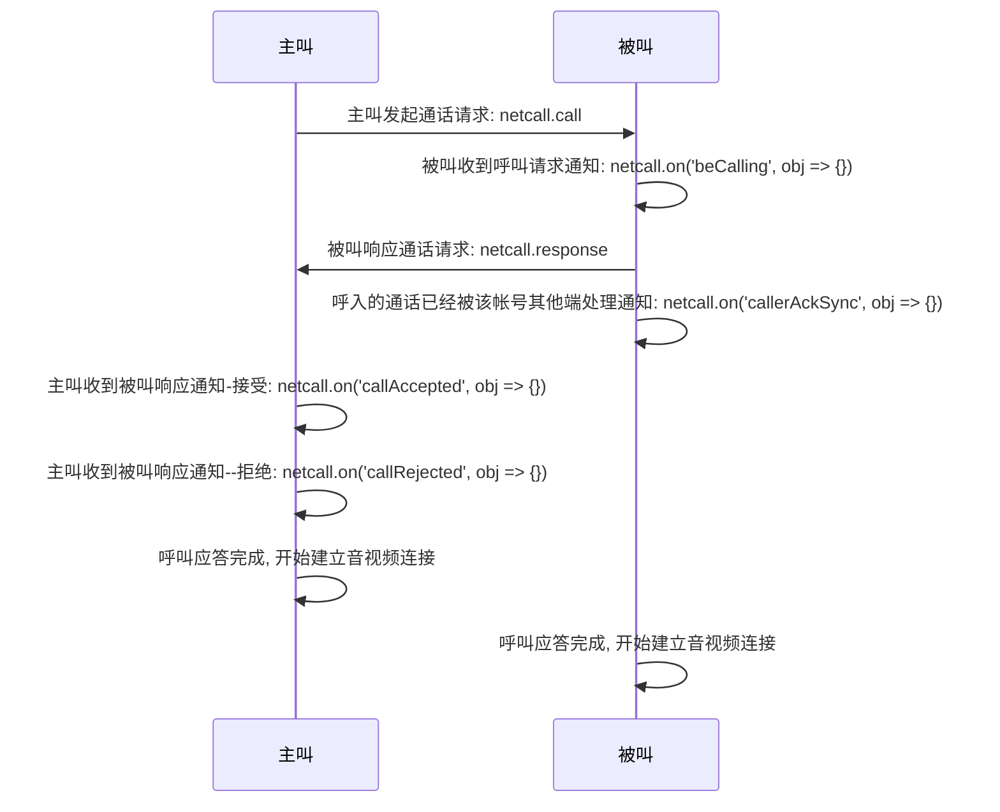
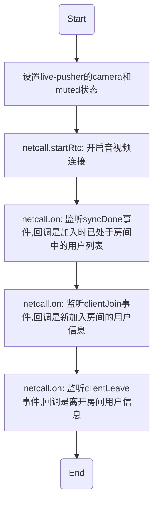

# <span id="点对点音视频通话">点对点音视频通话</span>

点对点音视频通话功能包含点对点的音频通话和点对点的音视频通话，提供**呼叫**、**接听**、**挂断**、**话单通知**等功能。通过阅读该章节，您可以快速了解点对点实时音视频通话的流程，帮助您迅速搭建一个最简单的点对点实时音视频通话功能。

## <span id="呼叫/接听流程">呼叫/接听流程</span>



### <span id="音视频通话">主叫发起通话请求</span>

* API 介绍:
  * 该方法可以立即向被叫方发起通话请求，对于移动 native 端，将发起持续呼叫
  * `请开发者自己做好呼叫超时处理`
* 示例

```js
netcall
  .call({
    type: type, // 通话类型：1音频，2视频
    callee: callee, // 被叫账号
    forceKeepCalling: true // 持续呼叫
  })
  .then(function() {
    // 成功发起呼叫
    console.log('呼叫成功！')
  })
  .catch(function(err) {
    console.error(error)
  });
// 设置超时计时器
let callTimer = setTimeout(function() {
  // 请在对方处理后，清除呼叫定时器，否则将执行挂断逻辑
  console.log('超时未接听, hangup');
  netcall.hangup();
}, 1000 * 30);
```

* 参数说明

| 参数名 | 类型 | 说明 |
| :-- | --: | --: |
| type | number | 通话类型：1音频，2视频 |
| account | string | 呼叫对方账号（IM账号） |
| forceKeepCalling | Boolean | 是否开启持续呼叫，true是开启持续呼叫 |

### <span id="被叫收到通话请求回调">被叫收到呼叫通知</span>

* API 介绍
  * 主叫发起通话请求后，被叫将收到呼叫通知，这时开发者可以依据一些自己的逻辑进行状态判断是否展示对应的 UI 和响应按钮
  * `请开发者自己做好呼叫超时处理`
* 示例

```js
let infoOfBeCalled = null
netcall.on('beCalling', (obj) => {
  console.log('beCalling')
  console.log(obj)
  infoOfBeCalled = obj
})
```

* 参数说明
  obj 为收到的呼叫通知内容对象

| obj 属性 | 类型 | 说明 |
| :-- | --: | --: |
| caller | string | 主叫 account |
| type | number | 主叫发起的通话类型（音频还是视频） |
| cid | string | 此通通话的唯一 ID 值，开发者可用于判断是否是同一通呼叫 |

### <span id="被叫响应通话请求">被叫响应通话请求</span>

* API 介绍
  * 被叫收到呼叫请求后，可以选择接听或者拒绝，具体代码如下
* 示例

```js
// 接听

// 告知对方，接听本通通话
netcall.response({
  accepted: true, // 是否接听，true为接听；false为拒绝
  // infoOfBeCalled为前面被叫时传递过来的信息
  caller: infoOfBeCalled.caller, // 本通通话主叫方账号
  type: infoOfBeCalled.type, // 本通通话类型
  cid: infoOfBeCalled.cid // 本通通话房间ID
})
  .then(() => {
    // 开启本端的音视频通话
    netcall.startRtc({ mode: 0 })
      .then((obj) => {
        // obj结构 => {uid,account,cid}
        console.log('开启音视频成功', obj)
      })
  })
  .catch((error) => {
    console.error(error)
  })


// 拒绝

// 告知对方，拒绝本通通话
netcall.response({
  accepted: false,
  // infoOfBeCalled为前面被叫时传递过来的信息
  caller: infoOfBeCalled.caller, 
  type: infoOfBeCalled.type,
  cid: infoOfBeCalled.cid
})
  .then(() => {
    console.log('拒绝成功')
  })
  .catch((error) => {
    console.error(error)
  })
```

### <span id="主叫收到被叫响应回调">主叫收到被叫响应回调</span>

* API 介绍
  * 被叫根据自己的意愿做出呼叫应答之后，主叫将收到呼叫回应通知
* 示例

```js
// 被叫拒绝的通知
netcall.on('callRejected', function(obj) {
  console.log('被叫拒绝了', obj);
  // 清除呼叫定时器
  clearCallTimer();
  // 清除用户UI逻辑（例如清除呼叫界面）
});

// 被叫接受的通知
netcall.on('callAccepted', function(obj) {
  console.log('on 被叫接听了', obj);
  // 缓存呼叫类型，后面开启音视频连接需要用到
  type = obj.type;
  // 清除呼叫定时器
  clearCallTimer();
  // 开启音视频逻辑
  netcall.startRtc({ mode: 0 })
  .then((obj) => {
    // obj结构 => {uid,account,cid}
    console.log('开启音视频成功', obj)
  })
});
```

### <span id="呼入的通话已经被该帐号其他端处理">呼入的通话已经被该帐号其他端处理</span>

* API 介绍
  * 当收到呼叫时，如果账号存在多端登录的情况并且其他端已经对该通呼叫做了应答，这时 Web 端回到提示通知：已被其他端处理
* 示例

```js
netcall.on('callerAckSync', function(obj) {
  console.log('其他端已经处理了本通通话', obj);
});
```

* 参数说明

obj 为其他端已处理的回调对象

| obj 属性       |   类型 |                                        说明 |
| :------------- | -----: | ------------------------------------------: |
| timetag        | string |                                      时间戳 |
| cid      | string |                        当前通话的唯一 id 值 |
| type           | number |                        通话类型：音频、视频 |
| accepted       |   bool |                其他端做出的应答：接受、拒绝 |
| fromClientType | string | 从什么类型的终端做出的应答：IOS、Android 等 |

### <span id="开启音视频通话">开启音视频通话</span>

* API 介绍
  * 点对点通话中：呼叫应答完毕之后，通话双方即可开始音视频连接，一系列的步骤如下



* 示例

```js
const netcall = this.netcall // 音视频操作实例
// 开启音视频逻辑，mode表示加入方式，被叫时可在被叫回调中获取，主叫则自行设定
netcall.startRtc({ mode: type })
  .then((obj) => {
    // {uid,account,cid}
    console.log('开启音视频成功', obj)
    self.loginUser = obj
  })
netcall.on('syncDone', (obj) => {
  // obj => {code,errmsg,userlist:[{account, mode, pusher_secret, scene, uid,url}]}
  console.log('登录成功', obj)
  // 将获取过来的用户数据中的url设置到live-pusher或live-player组件上去
})
netcall.on('clientJoin', (obj) => {
  // obj => {account,cid,mode,uid,url}
  console.log('有用户加入', obj)
  // 将新加入的用户的url设置到live-player组件上去
})
netcall.on('clientLeave', (obj) => {
  // obj => {account,uid,id}
  console.log('有用户加入', obj)
  // 将离开的用户对应的live-player的url去除，并停止拉流
})
```

### <span id="结束通话">结束通话</span>

* API 介绍
  * 当不再继续通话时，可以调用该 API 结束当前通话，双方任意一方都可以进行该操作
  * 调用该方法之后，对方能立即收到挂断通知
  * 通话结束之后，请手动做通话断开的清理工作
* 示例

```js
// 主动挂断方调用此API
netcallInstance.hangup()
  .then(() => {
    console.log('挂断成功')
    // 清除对应的UI逻辑。。。
  })
  .catch((error) => {
    console.error(error)
  })


```

### <span id="收到对方的挂断通知">收到对方的挂断通知</span>

* API 介绍
  * 点对点通话过程中，当对方挂断通话时，己方会立即收到对方挂断的通知，这时己方需要挂断通话，并做相应的清理工作
* 示例

```js
// 对方收到挂断通知
netcallInstance.on('hangup', (obj) => {
  console.log('hangup--对端挂断了', obj)
  // 判断收到的挂断通知是否是本通通话
  if (obj.cid !== this.loginUser.cid) {
    console.warn('非本通通话，抛弃')
    return
  }
  // 清除对应的UI逻辑。。。
})
```

* 参数说明

obj 收到的挂断通知对象

| obj 属性  |   类型 |                                          说明 |
| :-------- | -----: | --------------------------------------------: |
| timetag   | string |                                        时间戳 |
| cid | string |                          当前通话的唯一 id 值 |
| account   | string |                                      对方账号 |
