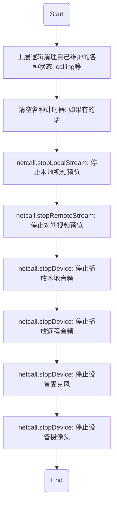

# <span id="通话结束的清理工作">通话结束的清理工作</span>

- API介绍
  - 通话结束后，需要手动做通话断开的清理工作，这里列一下最常见的清理步骤



| 返回类型|方法名 |说明 |
| :-------- | --------:| --------:|
| void | netcall.stopLocalStream|[停止本地视频预览](/docs/product/音视频通话/SDK开发集成/Web开发集成/播放?#停止预览本地摄像头)|
| void | netcall.stopRemoteStream|[停止对端视频预览](/docs/product/音视频通话/SDK开发集成/Web开发集成/播放?#停止预览远程视频流)|
| void | netcall.stopDevice|[停止设备麦克风](/docs/product/音视频通话/SDK开发集成/Web开发集成/采集?#关闭本地麦克风)|
| void | netcall.stopDevice|[停止设备摄像头](/docs/product/音视频通话/SDK开发集成/Web开发集成/采集?#关闭本地摄像头)|
| void | netcall.stopDevice|[停止播放本地音频](/docs/product/音视频通话/SDK开发集成/Web开发集成/播放?#播放本地音频)|
| void | netcall.stopDevice|[停止播放远程音频](/docs/product/音视频通话/SDK开发集成/Web开发集成/播放?#停止播放所有远程音频)|

- 示例

```js
// 停止本地视频预览
netcall.stopLocalStream()

// 停止对端视频预览
netcall.stopRemoteStream()

// 停止设备麦克风
netcall.stopDevice(Netcall.DEVICE_TYPE_AUDIO_IN)

// 停止设备摄像头
netcall.stopDevice(Netcall.DEVICE_TYPE_VIDEO)

// 停止播放本地音频
netcall.stopDevice(Netcall.DEVICE_TYPE_AUDIO_OUT_LOCAL)

// 停止播放对端音频
netcall.stopDevice(Netcall.DEVICE_TYPE_AUDIO_OUT_CHAT)
```
