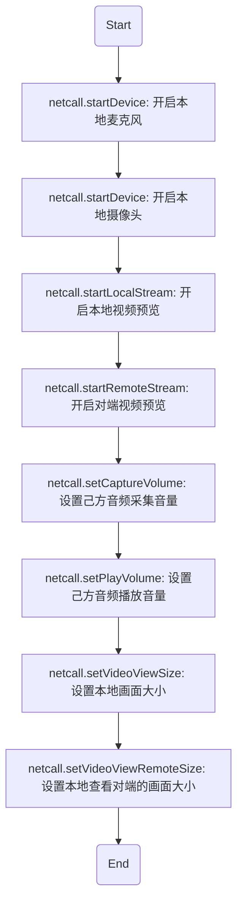

# <span id="点对点开启音视频连接(PCAgent)">点对点开启音视频连接(PC Agent)</span>

- API介绍
    - 点对点通话模式：呼叫应答完毕之后，通话双方即可开始音视频连接，一系列的步骤如下



- 示例

```js
const promise;
const netcall = this.netcall
// 开启麦克风
netcall.startDevice({
  type: Netcall.DEVICE_TYPE_AUDIO_IN
})
.then(function() {
  // 通知对方自己开启了麦克风
  netcall.control({
    command: Netcall.NETCALL_CONTROL_COMMAND_NOTIFY_AUDIO_ON
  })
})
.catch(function(err) {
  console.log('启动麦克风失败')
  console.log(err)
})

// 开启摄像头
netcall.startDevice({
  type: Netcall.DEVICE_TYPE_VIDEO,
  width: 640,
  height: 480
})
.then(function() {
  // 通知对方自己开启了摄像头
  netcall.control({
    command: Netcall.NETCALL_CONTROL_COMMAND_NOTIFY_VIDEO_ON
  })
})
.catch(function(err) {
  // 通知对方自己的摄像头不可用
  netcall.control({
    command: Netcall.NETCALL_CONTROL_COMMAND_SELF_CAMERA_INVALID
  })
  console.log('启动摄像头失败')
  console.log(err)
})

// 开启本地视频预览
netcall.startLocalStream()

// 开启远程视频预览
netcall.startRemoteStream()

// 开启本地音频播放
netcall.startDevice({
  type: Netcall.DEVICE_TYPE_AUDIO_OUT_CHAT
}).catch(function(err) {
  console.log('播放对方的声音失败')
  console.log(err)
})

// 设置本地音量采集大小, 该API可以在通话过程中动态调用调整自己的音量采集大小
netcall.setCaptureVolume(255)

// 设置本地音量播放大小, 该API可以在通话过程中动态调用调整自己的音量播放大小(即自己听对端的音量)
netcall.setPlayVolume(255)

// 设置本地视频画面大小
netcall.setVideoViewSize({
  width: 500,
  height: 500,
  cut: true
})

// 设置对端视频画面大小
netcall.setVideoViewRemoteSize({
  account: target,
  width: 500,
  height: 500,
  cut: true
})
```

- 具体方法说明

| 返回类型|方法名 |说明 |
| :-------- | --------:| --------:|
| promise | netcall.startDevice| [开启本地麦克风](/docs/product/音视频通话/SDK开发集成/Web开发集成/采集?#开启本地麦克风) |
| promise | netcall.startDevice| [开启本地摄像头](/docs/product/音视频通话/SDK开发集成/Web开发集成/采集?#开启本地摄像头) |
| promise | netcall.startLocalStream| [开启本地视频预览](/docs/product/音视频通话/SDK开发集成/Web开发集成/播放?#预览本地摄像头) |
| promise | netcall.setCaptureVolume| [设置己方音频采集音量](/docs/product/音视频通话/SDK开发集成/Web开发集成/采集?#设置音量采集大小) |
| promise | netcall.setPlayVolume| [设置己方音频播放音量](/docs/product/音视频通话/SDK开发集成/Web开发集成/播放?#设置播放音量大小) |
| promise | netcall.setVideoViewSize| [设置本地画面大小](/docs/product/音视频通话/SDK开发集成/Web开发集成/播放?#设置本地视频画面大小) |
| promise | netcall.startDevice| [播放对方声音](/docs/product/音视频通话/SDK开发集成/Web开发集成/播放?#播放对方音频) |
| promise | netcall.startRemoteStream| [预览对方视频画面](/docs/product/音视频通话/SDK开发集成/Web开发集成/播放?#预览远程视频流) |
| promise | netcall.setVideoViewRemoteSize| [设置对方画面大小](/docs/product/音视频通话/SDK开发集成/Web开发集成/播放?#设置远程视频画面大小) |