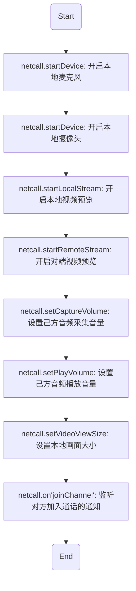

# <span id="点对点开启音视频连接">点对点开启音视频连接</span>

- API介绍
    - 多人通话模式：成功加入房间之后，即可开始音视频连接，一系列的步骤如下



- 示例

```js
const promise;
const netcall = this.netcall
const promise = Promise.resolve()

promise.then(function() {
  // 开启麦克风
  return netcall.startDevice({
    type: Netcall.DEVICE_TYPE_AUDIO_IN
  }).catch(function(err) {
    console.log('启动麦克风失败')
    console.error(err)
  })
})
.then(function() {
  // 设置采集音量
  netcall.setCaptureVolume(255)
  // 开启摄像头
  return netcall.startDevice({
	  type: Netcall.DEVICE_TYPE_VIDEO,
	  width: 640,
	  height: 480
	})
  .catch(function(err) {
    console.log('启动摄像头失败')
    console.error(err)
  })
})
.then(function() {
  // 设置本地预览画面大小
  netcall.setVideoViewSize({
    with: 500,
    height: 500,
    cut:true
  })
})
.then(function() {
  // 设置互动者角色
  netcall.changeRoleToPlayer()
  // 开启RTC连接
  console.log("开始webrtc")
  return netcall.startRtc()
})
.then(function() {
  console.log("webrtc连接成功")
})
.catch(function(err) {
  console.log('发生错误, 挂断通话')
  console.log(err)
  netcall.hangup()
})

// 在回调里监听对方加入通话，并显示对方的视频画面
netcall.on('joinChannel', function(obj) {
  console.log('user join', obj)
  // 播放对方声音
  netcall.startDevice({
    type: Netcall.DEVICE_TYPE_AUDIO_OUT_CHAT
  }).catch(function(err) {
    console.log('播放对方的声音失败')
    console.error(err)
  })
  // 预览对方视频画面
  netcall.startRemoteStream({
    account: obj.account,
    node: document.getElementById('remoteContainer')
  })
  // 设置对方预览画面大小
  netcall.setVideoViewRemoteSize({
    account: 'testAccount',
    with: 500,
    height: 500,
    cut:true
  })
})
```

- 具体方法说明

| 返回类型|方法名 |说明 |
| :-------- | --------:| --------:|
| promise | netcall.startDevice| [开启本地麦克风](/docs/product/音视频通话/SDK开发集成/Web开发集成/采集?#开启本地麦克风) |
| promise | netcall.startDevice| [开启本地摄像头](/docs/product/音视频通话/SDK开发集成/Web开发集成/采集?#开启本地摄像头) |
| promise | netcall.startLocalStream| [开启本地视频预览](/docs/product/音视频通话/SDK开发集成/Web开发集成/播放?#预览本地摄像头) |
| promise | netcall.setCaptureVolume| [设置己方音频采集音量](/docs/product/音视频通话/SDK开发集成/Web开发集成/采集?#设置音量采集大小) |
| promise | netcall.setPlayVolume| [设置己方音频播放音量](/docs/product/音视频通话/SDK开发集成/Web开发集成/播放?#设置播放音量大小) |
| promise | netcall.setVideoViewSize| [设置本地画面大小](/docs/product/音视频通话/SDK开发集成/Web开发集成/播放?#设置本地视频画面大小) |
| promise | netcall.startDevice| [播放对方声音](/docs/product/音视频通话/SDK开发集成/Web开发集成/播放?#播放对方音频) |
| promise | netcall.startRemoteStream| [预览对方视频画面](/docs/product/音视频通话/SDK开发集成/Web开发集成/播放?#预览远程视频流) |
| promise | netcall.setVideoViewRemoteSize| [设置对方画面大小](/docs/product/音视频通话/SDK开发集成/Web开发集成/播放?#设置远程视频画面大小) |