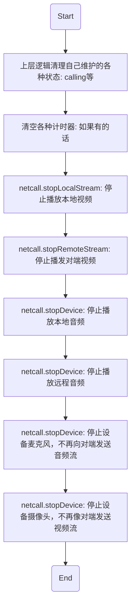

# <span id="初始化">初始化</span>

音视频的接入需要依赖 IM 的账号系统，所以音视频的初始化需要依赖 IM 实例，这里需要首先初始化 IM，再初始化音视频

## <span id="初始化IM">初始化 IM</span>

初始化 IM, 完成 IM 的登录连接操作 [请参照 IM 初始化章节](/docs/product/IM即时通讯/SDK开发集成/Web开发集成/初始化)

**请注意**：`IM连接成功后`方可进行音视频通话，否则音视频通话会失败

## <span id="初始化音视频">初始化音视频</span>

PC Agent 和 WebRTC 的初始化方式不太一样，这里分别举例

### <span id="初始化音视频(Agent)">初始化音视频(PC Agent)</span>

以下是示例代码

```js
const netcall = Netcall.getInstance({
  kickLast: false,
  nim: nim,
  container: document.getElementById('container'),
  remoteContainer: document.getElementById('remoteContainer'),
  mirror: true,
  mirrorRemote: true
})
```

* 参数说明

| 参数名          |   类型 |                                                                                            说明 |
| :-------------- | -----: | ----------------------------------------------------------------------------------------------: |
| kickLast        |   bool |                                                                  是否踢掉上次的通话, 默认 false |
| nim             | object |                                           音视频通话是基于 IM 的, 需要传入 `NIM 初始化后的实例` |
| container       |    dom |                                                                      播放自己视频画面的容器节点 |
| remoteContainer |    dom |                                                                          播放对方画面的容器节点 |
| mirror          |   bool | 是否对自己的画面进行镜像处理, 默认 false, 一般来讲请将此参数设置为 true（既自己看自己是反项的） |
| mirrorRemote    |   bool |                                                        是否对对方的画面进行镜像处理, 默认 false |

#### <span id="初始化">初始化信令</span>

Web 音视频通话依赖于 PC 插件, 所以在使用任何音视频通话功能之前, 需要先建立和 PC 插件之间的信令通道, 示例代码如下

```js
var signalInited = false;
// 信令通道初始化完毕之后, 开发者可以启用音视频通话相关的 UI, 比如说展示呼叫别人的按钮
// 信令通道初始化失败的时候, 请展示错误并禁用所有音视频通话相关的 UI
netcall
  .initSignal()
  .then(function() {
    console.log('signalInited');
    signalInited = true;
  })
  .catch(function(err) {
    console.log('initSignalError', err);
    signalInited = false;
  });
// 当信令通道断开时, 会触发 signalClosed 事件
netcall.on('signalClosed', function() {
  console.log('on signalClosed');
  signalInited = false;
  netcall.hangup();
});
// 初始化过程中会通过 devices 事件回传所有的设备列表
netcall.on('devices', function(obj) {
  console.log('on devices', obj);
});
```

#### <span id="停止信令">停止信令</span>

当音视频通话结束之后, 需要停止信令通道, 然后禁用所有音视频通话相关的 UI, 示例代码如下

```js
netcall.stopSignal();
```

### <span id="初始化音视频(WebRTC)">初始化音视频(WebRTC)</span>

以下是示例代码

```js
// SDK重命名
const Netcall = WebRTC;
const netcall = Netcall.getInstance({
  nim: nim,
  container: document.getElementById('container'),
  remoteContainer: document.getElementById('remoteContainer'),
  chromeId: '', 
  // 是否开启日志打印
  debug: true
});
```

* 参数说明

| 参数名          |   类型 |                                                  说明 |
| :-------------- | -----: | ----------------------------------------------------: |
| nim             | object | 音视频通话是基于 IM 的, 需要传入 `NIM 初始化后的实例` |
| container       |    dom |                            播放自己视频画面的容器节点 |
| remoteContainer |    dom |                                播放对方画面的容器节点 |
| chromeId        | string |                                chrome屏幕共享插件id（可选） |
| debug           |   bool |                          是否开启日志打印，默认 false |

### <span id="初始注册事件监听">初始注册事件监听</span>

在初始化音视频通话之后, 在进行音视频通话之前, 请先注册监听一些音视频通话通知事件, 基本上所有的音视频通话操作都是异步的, 而且这些操作会触发音视频通话的某些事件, 具体事件会在各个操作里面详细介绍.

#### <span id="被叫收到呼叫的通知">被叫收到呼叫的通知</span>

* API 介绍
  * 主叫发起通话请求后，被叫将收到呼叫通知，这时开发者可以依据一些自己的逻辑进行状态判断是否展示对应的 UI 和响应按钮
* 示例

```js
// 是否被叫中
let beCalling = false;
// 呼叫类型
let type = null;
// 被叫信息
let beCalledInfo = null;
// 是否正忙
let busy = false;
// 开启监听
netcall.on('beCalling', function(obj) {
  console.log('on beCalling', obj);
  const channelId = obj.channelId;
  // 被叫回应主叫自己已经收到了通话请求
  netcall.control({
    channelId: channelId,
    command: Netcall.NETCALL_CONTROL_COMMAND_START_NOTIFY_RECEIVED
  });
  // 只有在没有通话并且没有被叫的时候才记录被叫信息, 否则通知对方忙并拒绝通话
  if (!netcall.calling && !beCalling) {
    type = obj.type;
    beCalling = true;
    beCalledInfo = obj;
  } else {
    if (netcall.calling) {
      busy = netcall.notCurrentChannelId(obj);
    } else if (beCalling) {
      busy = beCalledInfo.channelId !== channelId;
    }
    if (busy) {
      netcall.control({
        channelId: channelId,
        command: Netcall.NETCALL_CONTROL_COMMAND_BUSY
      });
      // 拒绝通话
      netcall.response({
        accepted: false,
        beCalledInfo: obj
      });
    }
  }
});
```

* 参数说明
  obj 为收到的呼叫通知内容对象，这里只展示对开发者有用的几个字段

| obj 属性  |   类型 |                                                       说明 |
| :-------- | -----: | ---------------------------------------------------------: |
| account   | string |                                               主叫 account |
| type      | number |                         主叫发起的通话类型（音频还是视频） |
| channelId | string | 该通呼叫会话的唯一 id 值，开发者可用于判断是否是同一通呼叫 |

#### <span id="主叫收到被叫接受的通知">主叫收到被叫接受的通知</span>

* API 介绍

  * 被叫同意通话后，主叫会收到该通知，请参见[主叫收到被叫响应回调](/docs/product/音视频通话/SDK开发集成/Web开发集成/音视频通话流程点对点?#主叫收到被叫响应回调)
  * 收到该通知后，可以开启 [音视频连接](/docs/product/音视频通话/SDK开发集成/Web开发集成/音视频通话流程点对点?#开启音视频连接)

* 示例

```js
// 被叫接受的通知
netcall.on('callAccepted', function(obj) {
  console.log('on callAccepted', obj);
  // 如果呼叫之前，启动了超时倒计时，这里可以取消呼叫倒计时
  clearCallTimer();
  // 可以开启音视频连接操作。。。
});
```

* 参数说明

obj 为呼叫应答的回调通知对象

| obj 属性 |   类型 |                       说明 |
| :------- | -----: | -------------------------: |
| account  | string |                   被叫账号 |
| type     | number | 音视频呼叫类型：音频、视频 |

#### <span id="主叫收到被叫拒绝的通知">主叫收到被叫拒绝的通知</span>

* API 介绍

  * 被叫拒绝通话后，主叫会收到该通知，此时主叫就应该做如下一系列 [扫尾工作，请见这里](/docs/product/音视频通话/SDK开发集成/Web开发集成/音视频通话流程点对点?#通话结束的清理工作)
    * 停止计时器
    * 清空各种呼叫状态

* 示例

```js
// 被叫拒绝的通知
netcall.on('callRejected', function(obj) {
  console.log('on callRejected', obj);
  // 如果呼叫之前，启动了超时倒计时，这里可以取消呼叫倒计时
  clearCallTimer();
  // 挂断
  hangup();
  // 做清理工作
  resetWhenHangup();
});
```

* 参数说明

obj 为呼叫应答的回调通知对象

| obj 属性 |   类型 |                       说明 |
| :------- | -----: | -------------------------: |
| account  | string |                   被叫账号 |
| type     | number | 音视频呼叫类型：音频、视频 |

#### <span id="通话中收到远端的控制指令">通话中收到远端的控制指令</span>

* API 介绍

  * 通话过程中，可以通过监听该通知接口来接收各种通话指令的通知，做出相应处理

* 示例

```js
netcall.on('control', function(obj) {
  console.log('收到指令', obj);
});
```

* 参数说明

obj 为指令通知对象

| param 属性 |   类型 |                                                                                                    说明 |
| :--------- | -----: | ------------------------------------------------------------------------------------------------------: |
| channelId  | number |                                                                                   需要发送指令的房间 id |
| command    | number | 指令类型,[具体值请参照这里](/docs/product/音视频通话/SDK开发集成/Web开发集成/总体参数说明?#ControlType) |

#### <span id="收到挂断通知">收到挂断通知</span>

* API 介绍
  * 点对点通话过程中，当对方挂断通话时，己方会立即收到对方挂断的通知，这时己方需要挂断通话，并做相应的[清理工作](/docs/product/音视频通话/SDK开发集成/Web开发集成/音视频通话流程点对点?#通话结束的清理工作)
* 示例

```js
netcall.on('hangup', function(obj) {
  console.log('on hangup', obj);
  // 判断需要挂断的通话是否是当前正在进行中的通话
  if (!beCalledInfo || beCalledInfo.channelId === obj.channelId) {
    // 清理工作
    resetWhenHangup();
  }
});
```

* 参数说明

obj 收到的挂断通知对象

| obj 属性  |   类型 |                                          说明 |
| :-------- | -----: | --------------------------------------------: |
| timetag   | string |                                        时间戳 |
| channelId | string |                          当前通话的唯一 id 值 |
| account   | string |                                      对方账号 |
| type      | number | 挂断类型：0 为正常挂断，-1 位异常挂断(超时等) |

#### <span id="其他端已处理的通知">其他端已处理的通知</span>

* API 介绍
  * 点对点收到呼叫通知时，如果账号存在多端登录的情况并且其他端已经对该通呼叫做了应答，这时 Web 端回到提示通知：已被其他端处理
* 示例

```js
netcall.on('callerAckSync', function(obj) {
  console.log('其他端已经做了处理', obj);
});
```

* 参数说明

obj 为其他端已处理的回调对象

| obj 属性       |   类型 |                                        说明 |
| :------------- | -----: | ------------------------------------------: |
| timetag        | string |                                      时间戳 |
| channelId      | string |                        当前通话的唯一 id 值 |
| type           | number |                        通话类型：音频、视频 |
| accepted       |   bool |                其他端做出的应答：接受、拒绝 |
| fromClientType | string | 从什么类型的终端做出的应答：IOS、Android 等 |


#### <span id="sdk内部消息通知">sdk内部消息通知</span>

* API 介绍
  * sdk内部出现错误或者服务器反馈一些通知（无法继续进行通话）时，会触发该回调通知事件，这时开发者可以根据需要调用方法获取信息
* 示例

```js
netcall.on('error', function(obj) {
  console.log('sdk反馈错误信息', obj);
  if(obj.code){
    if(obj.code == 509){
      console.warn('你被提出房间了');
    }
    else if(obj.code == 500){
      console.warn('你的web不支持H264视频编码，无法进行呼叫，请检测浏览器的H264插件是否正常');
    }
  }
});
```

* 参数说明

obj 反馈的消息对象

| 属性 |   类型 |       说明     |
| :-----| -----: | ---------------:|
| code  | number | 错误码 |
| desc  | string | 错误信息描述 |


#### <span id="用户加入房间通知">用户加入房间通知</span>

* API 介绍

  * 多人通话中，加入多人房间后，如果有用户加入了当前房间，当前房间中的所有人都会收到该通知，做出相应处理
    * 开启新加入的用户的视频画面显示

* 示例

```js
netcall.on('joinChannel', function(obj) {
  // 通知上层有其他用户加入了房间，上层做相应逻辑和UI处理
  // 这里可以播放加入的同学的视频流
  // 以及播放对方声音
  netcall
    .startDevice({
      type: Netcall.DEVICE_TYPE_AUDIO_OUT_CHAT
    })
    .catch(function() {
      console.log('播放对方的声音失败');
    });

  // 预览加入的同学的视频流
  netcall.startRemoteStream({
    account: obj.account,
    node: document.getElementById('remoteContainer')
  });

  // 设置对方预览画面大小
  netcall.setVideoViewRemoteSize({
    account: 'testAccount',
    with: 500,
    height: 500,
    cut: true
  });
});
```

* 参数说明

obj 为通知消息对象

| obj 属性  |   类型 |               说明 |
| :-------- | -----: | -----------------: |
| account   | string | 新加入同伴的 accid |
| channelId | number |      加入的房间 id |

* 具体方法说明

| 返回类型 |                         方法名 |                                                                                            说明 |
| :------- | -----------------------------: | ----------------------------------------------------------------------------------------------: |
| promise  |            netcall.startDevice |             [这里是播放对方声音，根据传参不同，可以操作各端的音频和视频](/docs/product/音视频通话/SDK开发集成/Web开发集成/播放?#播放对方音频) |
| promise  |      netcall.startRemoteStream |       [播放对方视频画面](/docs/product/音视频通话/SDK开发集成/Web开发集成/播放?#预览远程视频流) |
| promise  | netcall.setVideoViewRemoteSize | [设置对方画面大小](/docs/product/音视频通话/SDK开发集成/Web开发集成/播放?#设置远程视频画面大小) |

#### <span id="用户离开房间通知">用户离开房间通知</span>

* API 介绍
  * 多人通话中，加入房间后，如果有同伴离开房间，当前房间里的所有人都会收到该同伴离开会议的通知，开发者可以根据该通知做出相应处理
* 示例

```js
netcall.on('leaveChannel', function(obj) {
  // 通知上层有其他用户离开了会议，上层做相应逻辑和UI处理

  // 停止预览该同伴的视频流
  netcall.stopRemoteStream({
    account: obj.account
  });
});
```

* 参数说明

obj 为通知消息对象

| obj 属性  |   类型 |             说明 |
| :-------- | -----: | ---------------: |
| account   | string | 离开同伴的 accid |
| channelId | number |    离开的房间 id |

* 具体方法说明

| 返回类型 |                   方法名 |                                                                                              说明 |
| :------- | -----------------------: | ------------------------------------------------------------------------------------------------: |
| promise  | netcall.stopRemoteStream | [停止预览对方视频画面](/docs/product/音视频通话/SDK开发集成/Web开发集成/播放?#停止预览远程视频流) |

#### <span id="音量大小实时回调通知">音量大小实时回调通知</span>

* API 介绍

  * 点对点通话中，通过监听该方法，可以实时收到通话双方的音量大小值，做出相应 UI 展示
  * 多人通话中，加入多人房间后，通过监听该方法，可以实时收到当前房间中所有人的音量大小值，做出相应 UI 展示

* 示例

```js
netcall.on('audioVolume', function(obj) {
  console.log('音量', obj);
});
```

* 参数说明

obj 为当前正在房间中所有人的音量对象，具体如下

| obj 属性               |  类型 |                       说明 |
| :--------------------- | ----: | -------------------------: |
| obj['self']            |   obj |             自己的音量对象 |
| obj['self'].status     | float |           自己的音量大小值 |
| obj['accountA']        |   obj |   账号`accountA`的音量对象 |
| obj['accountA'].status | float | 账号`accountA`的音量大小值 |

#### <span id="收到用户媒体流的通知">收到用户媒体流的通知</span>

* API 介绍

  * 双人和多人通话中，加入房间后，可以通过该监听事件获取到其他新加入用户的媒体流通知，并作出相应处理
    * 展示对应用户的画面
    * 进行音视频录制等
  * 该事件抛出的目的也是为了方便用户做自定义操作，自己对媒体流的轨道信息做各种包装处理
  * 只有WebRTC支持该回调
* 示例

```js
netcall.on('remoteTrack', function(obj) {
  console.log('收到远程轨道信息', obj);
  // 音频：播放对方的音频
  if (obj.track.kind === 'audio') {
    // 播放对方声音
    netcall
      .startDevice({
        type: Netcall.DEVICE_TYPE_AUDIO_OUT_CHAT
      })
      .catch(function() {
        console.log('播放对方的声音失败');
      });
  }

  // 视频：展示对方的画面
  if (obj.track.kind === 'video') {
    // 预览加入的同学的视频流
    netcall.startRemoteStream({
      account: obj.account,
      node: document.getElementById('remoteContainer')
    });

    // 设置对方预览画面大小
    netcall.setVideoViewRemoteSize({
      account: 'testAccount',
      with: 500,
      height: 500,
      cut: true
    });
  }
});
```

* 参数说明

obj 为通知消息对象

| obj 属性  |   类型 |             说明 |
| :-------- | -----: | ---------------: |
| account   | string | 新加入同伴的 account |
| channelId | number |    加入的房间 id |

* 具体方法说明

| 返回类型 |                         方法名 |                                                                                            说明 |
| :------- | -----------------------------: | ----------------------------------------------------------------------------------------------: |
| promise  |            netcall.startDevice |             [播放对方声音](/docs/product/音视频通话/SDK开发集成/Web开发集成/播放?#播放对方音频) |
| promise  |      netcall.startRemoteStream |       [预览对方视频画面](/docs/product/音视频通话/SDK开发集成/Web开发集成/播放?#预览远程视频流) |
| promise  | netcall.setVideoViewRemoteSize | [设置对方画面大小](/docs/product/音视频通话/SDK开发集成/Web开发集成/播放?#设置远程视频画面大小) |

#### <span id="设备新增通知">设备新增通知</span>

* API 介绍

  * 插入外接摄像头、麦克风、扬声器时，会触发该回调通知事件，并通过回调告知开发者当前新增的设备列表

* 示例

```js
netcall.on('deviceAdd', function(devices) {
  console.log('新增设备列表', devices);
}
```

* 参数说明

devices 当前新增的设备列表数组

| devices[0]属性 |   类型 |       说明 |
| :------------- | -----: | ---------: |
| deviceId       | string | 设备 id 值 |
| label          | string | 设置标签名 |

#### <span id="设备移除通知">设备移除通知</span>

* API 介绍

  * 拔出外接摄像头、麦克风、扬声器时，会触发该回调通知事件，并通过回调告知开发者当前移除的设备列表

* 示例

```js
netcall.on('deviceRemove', function(devices) {
  console.log('移除设备列表', devices);
}
```

* 参数说明

devices 当前移除的设备列表数组

| devices[0]属性 |   类型 |       说明 |
| :------------- | -----: | ---------: |
| deviceId       | string | 设备 id 值 |
| label          | string | 设置标签名 |

#### <span id="设备状态变化通知">设备状态变化通知</span>

* API 介绍

  * 插拔摄像头、麦克风或者外接扬声器时，会触发该回调通知事件，这时开发者可以根据需要调用方法检测新的设备状态

* 示例

```js
netcall.on('deviceStatus', function(obj) {
  console.log('设备状态发生变化', obj);

  // 检查摄像头
  netcall.getDevicesOfType(WebRTC.DEVICE_TYPE_VIDEO).then(function(devices) {
    console.log('摄像头', devices);
  });

  // 检查麦克风
  netcall.getDevicesOfType(WebRTC.DEVICE_TYPE_AUDIO_IN).then(function(devices) {
    console.log('麦克风', devices);
  });

  // 检查扬声器
  netcall
    .getDevicesOfType(WebRTC.DEVICE_TYPE_AUDIO_OUT_CHAT)
    .then(function(devices) {
      console.log('扬声器', devices);
    });
});
```

* 参数说明

devices 当前检测设备类型返回的设备列表数组

| devices[0]属性 |   类型 |       说明 |
| :------------- | -----: | ---------: |
| deviceId       | string | 设备 id 值 |
| label          | string | 设置标签名 |


## <span id="音视频清理">音视频清理</span>

音视频网络通话相关功能调用结束后（即通话结束后），主动清理音视频功能（ps. 5.6.0版本开始的sdk为了减轻开发者工作，在点对点通话中调用完hangup接口即可，sdk内部会做一系列的清除工作；多人通话中调用完leaveChannel接口即可，sdk内部会做一系列的清除工作）。这里列一下最常见的清理步骤



| 返回类型 |                   方法名 |                                                                                            说明 |
| :------- | -----------------------: | ----------------------------------------------------------------------------------------------: |
| void     |  netcall.stopLocalStream |   [停止播放本地视频](/docs/product/音视频通话/SDK开发集成/Web开发集成/播放?#停止预览本地摄像头) |
| void     | netcall.stopRemoteStream |   [停止播发对端视频](/docs/product/音视频通话/SDK开发集成/Web开发集成/播放?#停止预览远程视频流) |
| void     |       netcall.stopDevice |         [停止设备麦克风，不再向对端发送音频流](/docs/product/音视频通话/SDK开发集成/Web开发集成/采集?#关闭本地麦克风) |
| void     |       netcall.stopDevice |         [停止设备摄像头，不再像对端发送视频流](/docs/product/音视频通话/SDK开发集成/Web开发集成/采集?#关闭本地摄像头) |
| void     |       netcall.stopDevice |         [停止播放本地音频](/docs/product/音视频通话/SDK开发集成/Web开发集成/播放?#播放本地音频) |
| void     |       netcall.stopDevice | [停止播放远程音频](/docs/product/音视频通话/SDK开发集成/Web开发集成/播放?#停止播放所有远程音频) |

* 示例

```js
// 清除上层逻辑自己维护的各种状态
clear();

// 停止本地视频预览
netcall.stopLocalStream();

// 停止对端视频预览
netcall.stopRemoteStream();

// 停止设备麦克风
netcall.stopDevice(Netcall.DEVICE_TYPE_AUDIO_IN);

// 停止设备摄像头
netcall.stopDevice(Netcall.DEVICE_TYPE_VIDEO);

// 停止播放本地音频
netcall.stopDevice(Netcall.DEVICE_TYPE_AUDIO_OUT_LOCAL);

// 停止播放对端音频
netcall.stopDevice(Netcall.DEVICE_TYPE_AUDIO_OUT_CHAT);
```

