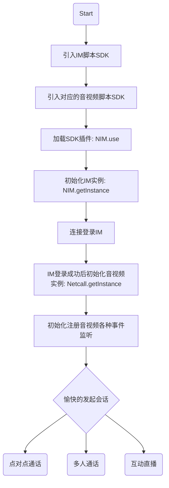

# 音视频总体流程图

```mermaid
graph TB
A(Start) --> B[引入IM脚本SDK]
B --> C[引入对应的音视频脚本SDK]
C --> D[加载SDK插件: NIM.use]
D --> E[初始化IM实例: NIM.getInstance]
E --> F[连接登录IM]
F --> G[IM登录成功后初始化音视频实例: Netcall.getInstance]
G --> H[初始化注册音视频各种事件监听]
H --> I{愉快的发起会话}
I --> J(点对点通话)
I --> K(多人通话)
I --> L(互动直播)
```