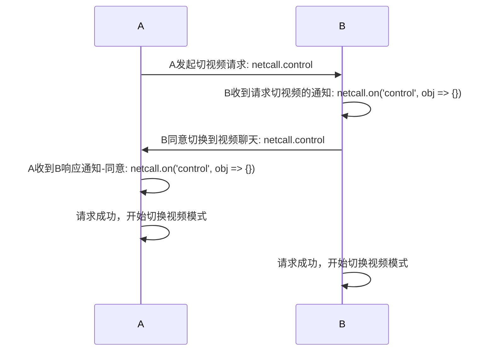
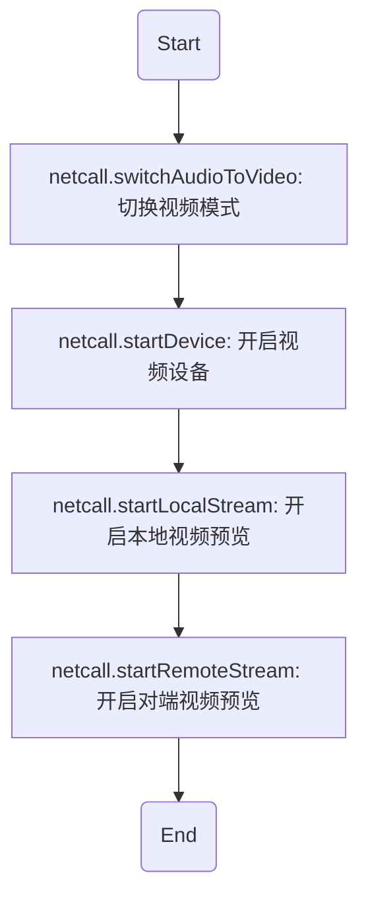
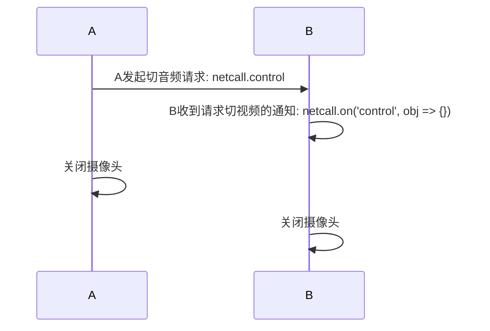

# <span id="通话过程控制">通话过程控制</span>

本章节介绍音视频通话过程中网易云提供的各种控制功能。包括**点对点通话的控制**、**多人房间的控制**和**通用控制**。

**点对点通话的控制**包括发送通话控制信息、设置静音、切换通话模式等

**多人房间的控制**包括改变自己在房间中的角色（互动者/观众）

**通用控制**包括是否接收某用户的音频或视频数据、动态切换一些参数等

## <span id="发送通话控制信息">发送通话控制信息</span>

- API介绍
  - 在通话过程中，可以通过该方法实时发送各种控制指令，常见指令如下
    - 通知对方自己收到了呼叫
    - 通知对方自己打开了音频麦克风
    - 通知对方自己打开了视频摄像头
    - 通知对方自己正忙
    - 通知对方自己麦克风不可用
    - 通知对方自己摄像头不可用
    - 通知对方自己请求从音频切换到视频
    - 通知对方自己同意切换到视频
    - 通知对方自己拒绝切换到视频
    - 通知对方从视频切换到音频

- 示例

```js
// 通知对方自己关闭了摄像头
var param = {
  channelId: 1511182568418,
  command: Netcall.NETCALL_CONTROL_COMMAND_NOTIFY_VIDEO_OFF
}
netcall.control(param)
```

- 参数说明

| param参数属性|类型 |说明 |
| :-------- | --------:| --------:|
| channelId | number|当前会话的唯一id值|
| command | number|会话控制指令[具体值请参照这里](/docs/product/音视频通话/SDK开发集成/Web开发集成/总体参数说明?#ControlType)|

## <span id="收到通话控制信息回调">收到通话控制信息回调</span>

- API介绍
  - 通话过程中通过监听该回调事件可以接收会话指令通知，做出相应处理

- 示例

```js
netcall.on('control', function(obj) {
  // 如果不是当前通话的指令, 直接丢掉
  if (netcall.notCurrentChannelId(obj)) {
    return
  }
  console.log('on control', obj)
})
```

- 参数说明

| obj参数属性|类型 |说明 |
| :-------- | --------:| --------:|
| channelId | number|当前会话的唯一id值|
| command | number|会话控制指令[具体值请参照这里](/docs/product/音视频通话/SDK开发集成/Web开发集成/总体参数说明?#ControlType)|

## <span id="点对点通话的控制">点对点通话的控制</span>

点对点音视频通话过程中，双方可以进行一键切换音视频模式，可以通过下面的方法进行控制，下面是一个简单的流程图

### <span id="音频切换到视频的流程">音频切换到视频的流程</span>



双方协商完成后，需要下列步骤开启视频聊天



### <span id="视频切换到音频的流程">视频切换到音频的流程</span>



### <span id="请求从音频切换到视频">请求从音频切换到视频</span>

- API介绍
  - 当前双方正处在音频通话时，如果某一方想切换为视频聊天，可以调用该方法发送请求

- 示例

```js
netcall.control({
  command: Netcall.NETCALL_CONTROL_COMMAND_SWITCH_AUDIO_TO_VIDEO
})
```

### <span id="同意从音频切换到视频">同意从音频切换到视频</span>

- API介绍
  - 收到请求切换视频的通知后，可以调用该方法回复通知：同意切视频，同时调用方法打开摄像头

- 示例

```js
netcall.control({
  command: Netcall.NETCALL_CONTROL_COMMAND_SWITCH_AUDIO_TO_VIDEO_AGREE
})

// 切换
netcall.switchAudioToVideo()

// 开启设备
netcall.startDevice({
  type: Netcall.DEVICE_TYPE_VIDEO,
  width: 500,
  height: 400
})

// 开启预览
netcall.startLocalStream()
netcall.startRemoteStream()
```

- 特殊说明
  - 对方在收到自己的同意通知之后，也调用相同的方法，切换到视频模式

### <span id="拒绝从音频切换到视频">拒绝从音频切换到视频</span>

- API介绍
  - 收到请求切换视频的通知后，如果不想开视频模式，可以发送拒绝的通知
  - 对方在收到该通知后，不需要做任何操作

- 示例

```js
netcall.control({
  command: Netcall.NETCALL_CONTROL_COMMAND_SWITCH_AUDIO_TO_VIDEO_REJECT
})
```

### <span id="从视频切换到音频">从视频切换到音频</span>

- API介绍
  - 当前双方正处在视频通话时，如果某一方想切换为音频聊天，可以调用该方法发送通知
  - 对方在收到该通知后，需要立即做关闭摄像头等相关操作

- 示例

```js
netcall.control({
  command: Netcall.NETCALL_CONTROL_COMMAND_SWITCH_VIDEO_TO_AUDIO
})
netcall.switchVideoToAudio()

// 关闭摄像头
netcall.stopDevice(Netcall.DEVICE_TYPE_VIDEO).then(function() {
  // 通知对方自己关闭了摄像头
  netcall.control({
    command: Netcall.NETCALL_CONTROL_COMMAND_NOTIFY_VIDEO_OFF
  })
})

// 停止预览
netcall.stopLocalStream()
netcall.stopRemoteStream()
```

## <span id="多人通话的控制">多人通话的控制</span>

### <span id="改变自己在房间中的角色">改变自己在房间中的角色</span>

- API介绍
  - 在多人房间模式中，可以通过该方法切换自己的房间中的角色，有以下两种

| 角色|说明 |
| :-------- | --------:|
| player | 互动者，可以发送自己的音频和视频给房间中的其他人呢|
| audience | 观众，只允许接收其他人的音频和视频，不能发送自己的音频和视频|

- 示例

```js
// 切换为互动者
netcall.changeRoleToPlayer().then(function(obj) {
  console.log('切换成功，当前角色', obj)
})

// 切换为观众
netcall.changeRoleToAudience().then(function(obj) {
  console.log('切换成功，当前角色', obj)
})

```

## <span id="通用控制">通用控制</span>

### <span id="指定某用户设置是否对其静音">指定某用户设置是否对其静音</span>

- API介绍
  - 在通话的过程中(尤其是在多人房间中)，可以选择不听某个参与者的声音，这时可以调用该方法指定对某参与者进行静音
  - 该方法不影响其他参与者收听目标参与者的声音

- 示例

```js
var account = 'testAccount'
netcall.setAudioBlack(account)
```

- 参数说明

| 参数名|类型 |说明 |
| :-------- | --------:| --------:|
| account |string|需要静音的目标账号|

### <span id="取消对某用户的静音">取消对某用户的静音</span>

- API介绍
  - 在通话的过程中(尤其是在多人房间中)，如果对某参与者静音了，想要重新收听该参与者的声音，可以调用该方法取消静音

- 示例

```js
var account = 'testAccount'
netcall.setAudioStart(account)
```

- 参数说明

| 参数名|类型 |说明 |
| :-------- | --------:| --------:|
| account |string|需要取消静音的目标账号|

### <span id="指定某用户设置是否接收其视频">指定某用户设置是否接收其视频</span>

- API介绍
  - 在通话的过程中(尤其是在多人房间中)，可以选择不看目标参与者的视频画面，这时可以调用该方法指定对目标参与者屏蔽视频
  - 该方法不影响其他参与者接收和观看目标参与者的视频画面

- 示例

```js
var account = 'testAccount'
netcall.setVideoBlack(account)
```

- 参数说明

| 参数名|类型 |说明 |
| :-------- | --------:| --------:|
| account |string|需要屏蔽画面的目标账号|

### <span id="取消对目标用户的视频屏蔽">取消对目标用户的视频屏蔽</span>

- API介绍
  - 在通话的过程中(尤其是在多人房间中)，如果屏蔽了目标参与者的视频画面，想要重新观看，可以调用该方法重新接收目标参与者的视频画面
  - 该方法不影响其他参与者接收和观看目标参与者的视频画面

- 示例

```js
var account = 'testAccount'
netcall.setVideoShow(account)
```

- 参数说明

| 参数名|类型 |说明 |
| :-------- | --------:| --------:|
| account |string|需要重新接收画面的目标账号|

### <span id="动态设置分辨率">动态设置分辨率(PC Agent)</span>

- API介绍
  - 在通话的过程中可以动态设置己方的视频质量，即自己对外传输的视频分辨率
  - `PC Agent适用!`

- 示例

```js
var videoQuality = Netcall.CHAT_VIDEO_QUALITY_720P
netcall.setSessionVideoQuality(videoQuality)
```

- 参数说明

| 参数名|类型 |说明 |
| :-------- | --------:| --------:|
| videoQuality |number|视频画面分辨率，[具体选值见这里](/docs/product/音视频通话/SDK开发集成/Web开发集成/总体参数说明?#videoQuality)|

### <span id="动态设置帧率">动态设置帧率(PC Agent)</span>

- API介绍
  - 在通话的过程中可以动态设置己方的视频帧率
  - `PC Agent适用!`

- 示例

```js
var videoFrameRate = Netcall.CHAT_VIDEO_FRAME_RATE_20
netcall.setSessionVideoFrameRate(videoFrameRate)
```

- 参数说明

| 参数名|类型 |说明 |
| :-------- | --------:| --------:|
| videoFrameRate |number|视频帧率，[具体选值见这里](/docs/product/音视频通话/SDK开发集成/Web开发集成/总体参数说明?#videoFrameRate)|

### <span id="动态设置码率">动态设置码率(PC Agent)</span>

- API介绍
  - 在通话的过程中可以动态设置己方的视频码率
  - `PC Agent适用!`

- 示例

```js
var videoQuality = 200000
netcall.setSessionVideoBitrate(videoQuality)
```

- 参数说明

| 参数名|类型 |说明 |
| :-------- | --------:| --------:|
| videoQuality |number|视频码率，100000 ~ 5000000 范围有效|
