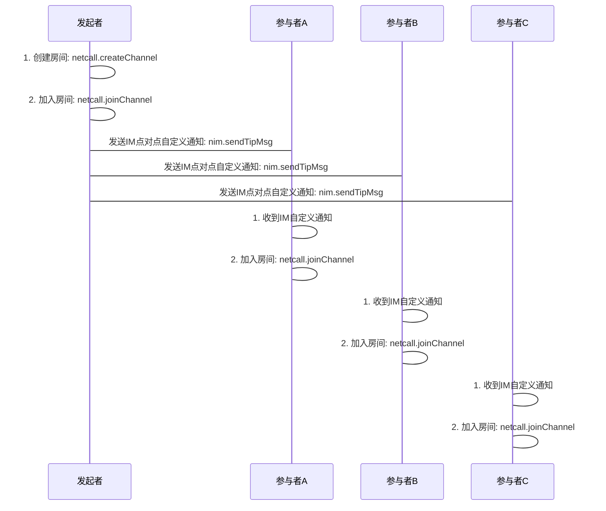
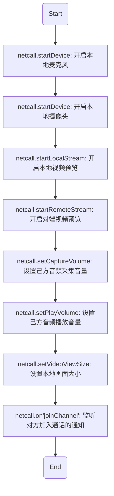
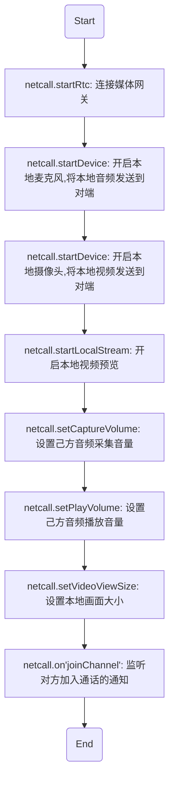

# <span id="多人音视频通话">多人音视频通话</span>

本章节介绍多人实时音视频通话的相关功能。多人实时音视频通话顾名思义是支持多个人同时进行实时音视频通话，可以选择纯音频模式，或音视频模式。在这里需要明确几个概念：

**房间：**房间就是用户进行多人实时音视频通话的地方，房间以房间名称为唯一标识，多人房间需要先创建成功后才能加入，当所有用户都离开房间后，可以复用该房间名重新创建。

**互动者：**互动者是指在多人通话时可以参与互动，可以发言的人，这些用户可以发送上行的音频或视频数据，也可以接收其他互动者下行的音频或视频数据。

**观众：**观众是指在多人通话时只可以观看的人，没有发言的权限，这些用户只可以接收互动者下行的音频或视频数据，不可以发送上行音频或视频数据。

其中互动者和观众身份可以随时切换。

## <span id="多人音视频通话流程图">多人音视频通话流程图</span>

与点对点通话的流程不同，多人房间暂不支持呼叫、推送和挂断等服务，只提供基本的创建、加入和离开房间接口。目前呼叫方案可以使用`IM点对点自定义通知`发送呼叫

`请开发者自己做好呼叫超时处理`



## <span id="创建房间">创建房间</span>

* API 介绍

  * 要想发起多人通话，需要先创建一个多人房间，本人和其他人才能加入房间。

* 示例

```js
netcall.createChannel({
  channelName: 'testChannelName' //必填
  custom: '测试自定义数据' //可选
  webrtcEnable: true // 是否支持WebRTC方式接入，可选，默认为不开启
}).then(function(obj) {
  // 预定房间成功后的上层逻辑操作
  // eg: 初始化房间UI显示
  // eg: 加入房间
})
```

* 参数说明

| 参数名       |   类型 |                                                                                                                            说明 |
| :----------- | -----: | ------------------------------------------------------------------------------------------------------------------------------: |
| channelName  | string |                                                                                          房间房号，可以任意英文字母和数组的组合 |
| custom       | string |                                                                            扩展字段，在通话的创建和加入之间传递自定义的额外信息 |
| webrtcEnable |   bool | 如果需要与 WebRTC 客户端互通，需要指定 WebRTC 兼容开关 `webrtcEnable` 为 true, **如果没有 WebRTC 客户端参与, 不要打开该开关**。 |

* 特殊说明
  * 同一个房间名称，只在房间使用完并且房间被销毁（所有人都离开房间）以后才可以重复使用，开发者需要保证不会出现重复预订某房间名称而不使用的情况。

## <span id="加入房间">加入房间</span>

* API 介绍
  * 多人房间创建成功后，可以通过该方法加入房间
* 示例

```js
const sessionConfig = {
  videoQuality: Netcall.CHAT_VIDEO_QUALITY_HIGH,
  videoFrameRate: Netcall.CHAT_VIDEO_FRAME_RATE_15,
  videoEncodeMode: Netcall.CHAT_VIDEO_ENCODEMODE_NORMAL,
  videoBitrate: 0,
  recordVideo: false,
  recordAudio: false,
  highAudio: false,
  bypassRtmp: false,
  rtmpUrl: '',
  rtmpRecord: false,
  splitMode: Netcall.LAYOUT_SPLITLATTICETILE
};
netcall
  .joinChannel({
    channelName: 'testChannelName', //必填
    type: Netcall.NETCALL_TYPE_VIDEO,
    sessionConfig: sessionConfig
  })
  .then(function(obj) {
    // 加入房间成功后的上层逻辑操作
    // eg: 开启摄像头
    // eg: 开启麦克风
    // eg: 开启本地流
    // eg: 设置音量采集、播放
    // eg: 设置视频画面尺寸等等，具体请参照p2p呼叫模式
  });
```

* 参数说明

| 参数名        |   类型 |                                                                                                                                                                  说明 |
| :------------ | -----: | --------------------------------------------------------------------------------------------------------------------------------------------------------------------: |
| channelName   | string |                                                                                                                                房间房号，可以任意英文字母和数组的组合 |
| type          | number |                                                                                                                                              房间通话类型，音频、视频 |
| sessionConfig | object | 通话配置, 每次通话会伴随着一次通话, 可以对此次通话进行一些配置,[具体属性见这里](/docs/product/音视频通话/SDK开发集成/Web开发集成/总体参数说明?#sessionConfig多人通话) |

## <span id="开启音视频连接">开启音视频连接</span>

### <span id="开启音视频连接Agent">音视频连接（PC Agent）</span>

* API 介绍
  * 多人通话模式：成功加入房间之后，即可开始音视频连接，一系列的步骤如下



* 示例

```js
// 缓存netcall实例
const netcall = this.netcall;
// 开启麦克风
netcall
  .startDevice({
    type: Netcall.DEVICE_TYPE_AUDIO_IN
  })
  .then(function() {
    // 通知对方自己开启了麦克风
    netcall.control({
      command: Netcall.NETCALL_CONTROL_COMMAND_NOTIFY_AUDIO_ON
    });
  })
  .catch(function(err) {
    console.log('启动麦克风失败');
    console.log(err);
  });

// 开启摄像头
netcall
  .startDevice({
    type: Netcall.DEVICE_TYPE_VIDEO,
    width: 640,
    height: 480
  })
  .then(function() {
    // 通知对方自己开启了摄像头
    netcall.control({
      command: Netcall.NETCALL_CONTROL_COMMAND_NOTIFY_VIDEO_ON
    });
  })
  .catch(function(err) {
    // 通知对方自己的摄像头不可用
    netcall.control({
      command: Netcall.NETCALL_CONTROL_COMMAND_SELF_CAMERA_INVALID
    });
    console.log('启动摄像头失败');
    console.error(err);
  });

// 开启本地视频预览
netcall.startLocalStream();

// 设置本地音量采集大小, 该API可以在通话过程中动态调用调整自己的音量采集大小
netcall.setCaptureVolume(255);

// 设置本地音量播放大小, 该API可以在通话过程中动态调用调整自己的音量播放大小(即自己听对端的音量)
netcall.setPlayVolume(255);

// 设置本地视频画面大小
netcall.setVideoViewSize({
  width: 500,
  height: 500,
  cut: true
});

// 在回调里监听对方加入通话，并显示对方的视频画面
netcall.on('joinChannel', function(obj) {
  console.log('user join', obj);
  // 播放对方声音
  netcall
    .startDevice({
      type: Netcall.DEVICE_TYPE_AUDIO_OUT_CHAT
    })
    .catch(function(err) {
      console.log('播放对方的声音失败');
      console.error(err);
    });
  // 预览对方视频画面
  netcall.startRemoteStream({
    account: obj.account,
    node: document.getElementById('remoteContainer')
  });
  // 设置对方预览画面大小
  netcall.setVideoViewRemoteSize({
    account: 'testAccount',
    width: 500,
    height: 500,
    cut: true
  });
});
```

* 具体方法说明

| 返回类型 |                         方法名 |                                                                                            说明 |
| :------- | -----------------------------: | ----------------------------------------------------------------------------------------------: |
| promise  |            netcall.startDevice |         [开启本地麦克风](/docs/product/音视频通话/SDK开发集成/Web开发集成/采集?#开启本地麦克风) |
| promise  |            netcall.startDevice |         [开启本地摄像头](/docs/product/音视频通话/SDK开发集成/Web开发集成/采集?#开启本地摄像头) |
| promise  |       netcall.startLocalStream |       [开启本地视频预览](/docs/product/音视频通话/SDK开发集成/Web开发集成/播放?#预览本地摄像头) |
| promise  |       netcall.setCaptureVolume | [设置己方音频采集音量](/docs/product/音视频通话/SDK开发集成/Web开发集成/采集?#设置音量采集大小) |
| promise  |          netcall.setPlayVolume | [设置己方音频播放音量](/docs/product/音视频通话/SDK开发集成/Web开发集成/播放?#设置播放音量大小) |
| promise  |       netcall.setVideoViewSize | [设置本地画面大小](/docs/product/音视频通话/SDK开发集成/Web开发集成/播放?#设置本地视频画面大小) |
| promise  |            netcall.startDevice |             [播放对方声音](/docs/product/音视频通话/SDK开发集成/Web开发集成/播放?#播放对方音频) |
| promise  |      netcall.startRemoteStream |       [预览对方视频画面](/docs/product/音视频通话/SDK开发集成/Web开发集成/播放?#预览远程视频流) |
| promise  | netcall.setVideoViewRemoteSize | [设置对方画面大小](/docs/product/音视频通话/SDK开发集成/Web开发集成/播放?#设置远程视频画面大小) |

### <span id="开启音视频连接WebRTC">音视频连接（WebRTC）</span>

* API 介绍
  * 多人通话模式：成功加入房间之后，即可开始音视频连接，一系列的步骤如下



* 示例

```js
const netcall = this.netcall

netcall.startRtc().then(function() {
  // 开启麦克风
  return netcall.startDevice({
    type: Netcall.DEVICE_TYPE_AUDIO_IN
  }).catch(function(err) {
    console.log('启动麦克风失败')
    console.error(err)
  })
})
.then(function() {
  // 设置采集音量
  netcall.setCaptureVolume(255)
  // 开启摄像头
  return netcall.startDevice({
	  type: Netcall.DEVICE_TYPE_VIDEO,
	  width: 640,
	  height: 480
	})
  .catch(function(err) {
    console.log('启动摄像头失败')
    console.error(err)
  })
})
.then(function() {
  //预览本地画面
  netcall.startLocalStream(
    document.getElementById('localContainer')
  )
  // 设置本地预览画面大小
  netcall.setVideoViewSize({
    width: 500,
    height: 500,
    cut:true
  })
})
.then(function() {
  // 设置互动者角色
  netcall.changeRoleToPlayer()
})
.catch(function(err) {
  console.log('发生错误')
  console.log(err)
  netcall.hangup()
})

// 在回调里监听对方加入通话，并显示对方的视频画面
netcall.on('remoteTrack', function(obj) {
  console.log('user join', obj)
  // 播放对方声音
  netcall.startDevice({
    type: Netcall.DEVICE_TYPE_AUDIO_OUT_CHAT
  }).catch(function(err) {
    console.log('播放对方的声音失败')
    console.error(err)
  })
  // 预览对方视频画面
  netcall.startRemoteStream({
    account: obj.account,
    node: document.getElementById('remoteContainer')
  })
  // 设置对方预览画面大小
  netcall.setVideoViewRemoteSize({
    account: 'testAccount',
    width: 500,
    height: 500,
    cut:true
  })
})
```

* 具体方法说明

| 返回类型 |                         方法名 |                                                                                            说明 |
| :------- | -----------------------------: | ----------------------------------------------------------------------------------------------: |
| promise  |            netcall.startRtc |         连接媒体网关 |
| promise  |            netcall.startDevice |         [开启本地麦克风，将本地音频发送到对端](/docs/product/音视频通话/SDK开发集成/Web开发集成/采集?#开启本地麦克风) |
| promise  |            netcall.startDevice |         [开启本地摄像头，将本地视频发送到对端](/docs/product/音视频通话/SDK开发集成/Web开发集成/采集?#开启本地摄像头) |
| promise  |       netcall.startLocalStream |       [开启本地视频预览](/docs/product/音视频通话/SDK开发集成/Web开发集成/播放?#预览本地摄像头) |
| promise  |       netcall.setCaptureVolume | [设置己方音频采集音量](/docs/product/音视频通话/SDK开发集成/Web开发集成/采集?#设置音量采集大小) |
| promise  |          netcall.setPlayVolume | [设置己方音频播放音量](/docs/product/音视频通话/SDK开发集成/Web开发集成/播放?#设置播放音量大小) |
| promise  |       netcall.setVideoViewSize | [设置本地画面大小](/docs/product/音视频通话/SDK开发集成/Web开发集成/播放?#设置本地视频画面大小) |
| promise  |            netcall.startDevice |             [播放对方声音](/docs/product/音视频通话/SDK开发集成/Web开发集成/播放?#播放对方音频) |
| promise  |      netcall.startRemoteStream |       [预览对方视频画面](/docs/product/音视频通话/SDK开发集成/Web开发集成/播放?#预览远程视频流) |
| promise  | netcall.setVideoViewRemoteSize | [设置对方画面大小](/docs/product/音视频通话/SDK开发集成/Web开发集成/播放?#设置远程视频画面大小) |

* 特殊说明
  * 这一系列的链式 Promise 调用，看起来非常不友好，如何让写法更加优雅呢，请[参考这里](/docs/product/通用/音视频文档类文件/web-pipe)

## <span id="离开房间">离开房间</span>

* API 介绍
  * 如果不再参与多人通话，可通过该 API 离开房间，离开房间后，房间中的其他人将不再听到你的声音，也不再看到你的画面
* 示例

```js
netcall.leaveChannel().then(function(obj) {
  // 离开房间后，开发者自己业务的扫尾工作
});
```

* 特殊说明
  * 离开房间后，如果房间房间里还有人，还可以再继续加入该房间


## <span id="用户加入房间通知">用户加入房间通知</span>

* API 介绍

  * 多人通话中，加入多人房间后，如果有用户加入了当前房间，当前房间中的所有人都会收到该通知，做出相应处理
    * 开启新加入的用户的视频画面显示

* 示例

```js
netcall.on('joinChannel', function(obj) {
  console.log('user joinchannel', obj);
});
```

* 参数说明

obj 为通知消息对象

| obj 属性  |   类型 |               说明 |
| :-------- | -----: | -----------------: |
| account   | string | 新加入同伴的 accid |
| channelId | number |      加入的房间 id |

## <span id="收到用户媒体流的通知">收到用户媒体流的通知</span>

* API 介绍

  * 双人和多人通话中，加入房间后，可以通过该监听事件获取到其他新加入用户的媒体流通知，并作出相应处理
    * 展示对应用户的画面
    * 进行音视频录制等
  * 该事件抛出的目的也是为了方便用户做自定义操作，自己对媒体流的轨道信息做各种包装处理
  * 只有 WebRTC 支持该回调

* 示例

```js
netcall.on('remoteTrack', function(obj) {
  console.log('收到远程轨道信息', obj);
  // 音频：播放对方的音频
  if (obj.track.kind === 'audio') {
    // 播放对方声音
    netcall
      .startDevice({
        type: Netcall.DEVICE_TYPE_AUDIO_OUT_CHAT
      })
      .catch(function() {
        console.log('播放对方的声音失败');
      });
  }

  // 视频：展示对方的画面
  if (obj.track.kind === 'video') {
    // 预览加入的同学的视频流
    netcall.startRemoteStream({
      account: obj.account,
      node: document.getElementById('remoteContainer')
    });

    // 设置对方预览画面大小
    netcall.setVideoViewRemoteSize({
      uid: 'testUid',
      width: 500,
      height: 500,
      cut: true
    });
  }
});
```

* 参数说明

obj 为通知消息对象

| obj 属性  |   类型 |             说明 |
| :-------- | -----: | ---------------: |
| uid       | string | 新加入同伴的 uid |
| channelId | number |    加入的房间 id |

* 具体方法说明

| 返回类型 |                         方法名 |                                                                                            说明 |
| :------- | -----------------------------: | ----------------------------------------------------------------------------------------------: |
| promise  |            netcall.startDevice |             [播放对方声音](/docs/product/音视频通话/SDK开发集成/Web开发集成/播放?#播放对方音频) |
| promise  |      netcall.startRemoteStream |       [预览对方视频画面](/docs/product/音视频通话/SDK开发集成/Web开发集成/播放?#预览远程视频流) |
| promise  | netcall.setVideoViewRemoteSize | [设置对方画面大小](/docs/product/音视频通话/SDK开发集成/Web开发集成/播放?#设置远程视频画面大小) |

## <span id="用户离开房间通知">用户离开房间通知</span>

* API 介绍
  * 多人通话中，加入房间后，如果有同伴离开房间，当前房间里的所有人都会收到该同伴离开会议的通知，开发者可以根据该通知做出相应处理
* 示例

```js
netcall.on('leaveChannel', function(obj) {
  // sdk内部会做一系列清理工作，此外开发者需要自己做业务逻辑和UI处理
});
```

* 参数说明

obj 为通知消息对象

| obj 属性  |   类型 |             说明 |
| :-------- | -----: | ---------------: |
| account   | string | 离开同伴的 accid |
| channelId | number |    离开的房间 id |

* 具体方法说明

| 返回类型 |                   方法名 |                                                                                              说明 |
| :------- | -----------------------: | ------------------------------------------------------------------------------------------------: |
| promise  | netcall.stopRemoteStream | [停止预览对方视频画面](/docs/product/音视频通话/SDK开发集成/Web开发集成/播放?#停止预览远程视频流) |
