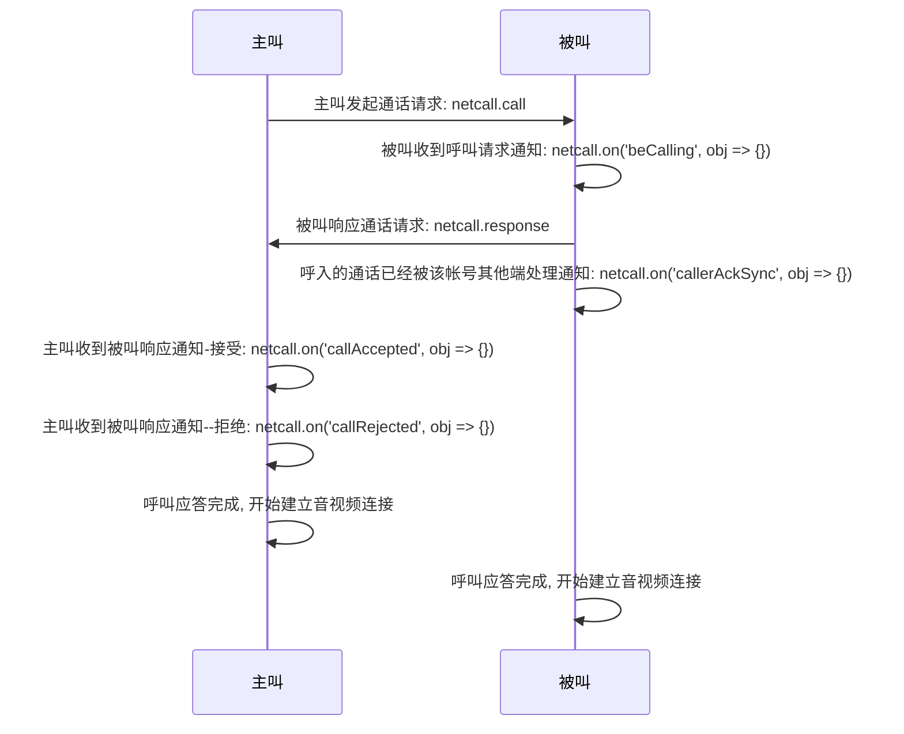
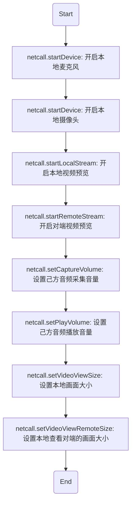
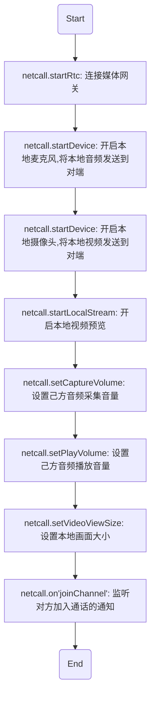
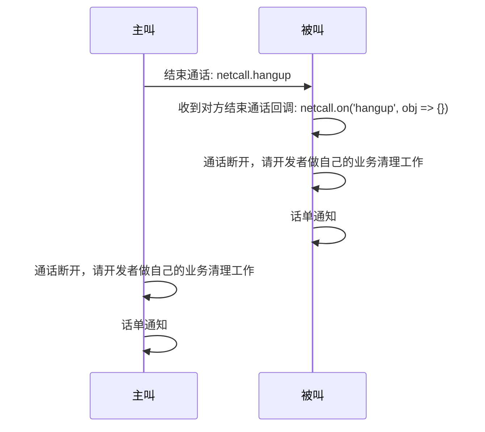
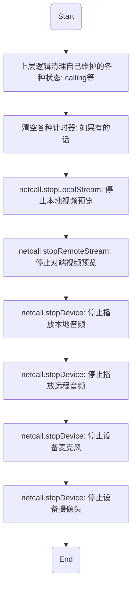

# <span id="点对点音视频通话">点对点音视频通话</span>

点对点音视频通话功能包含点对点的音频通话和点对点的音视频通话，提供**呼叫**、**接听**、**挂断**、**话单通知**等功能。通过阅读该章节，您可以快速了解点对点实时音视频通话的流程，帮助您迅速搭建一个最简单的点对点实时音视频通话功能。

## <span id="呼叫/接听流程">呼叫/接听流程</span>



### <span id="音视频通话">主叫发起通话请求</span>

* API 介绍:
  * 该方法可以立即向被叫方发起通话请求，对于移动 native 端，将发起持续呼叫
  * `请开发者自己做好呼叫超时处理`
* 示例

```js
const pushConfig = {
  enable: true,
  needBadge: true,
  needPushNick: true,
  pushContent: '',
  custom: '测试自定义数据',
  pushPayload: '',
  sound: '',
  forceKeepCalling: 0
};
const sessionConfig = {
  videoQuality: Netcall.CHAT_VIDEO_QUALITY_HIGH,
  videoFrameRate: Netcall.CHAT_VIDEO_FRAME_RATE_15,
  videoBitrate: 0,
  recordVideo: false,
  recordAudio: false,
  highAudio: false,
  bypassRtmp: false,
  rtmpUrl: '',
  rtmpRecord: false,
  splitMode: Netcall.LAYOUT_SPLITLATTICETILE
};
netcall
  .call({
    type: Netcall.NETCALL_TYPE_VIDEO,
    account: 'testAccount',
    pushConfig: pushConfig,
    sessionConfig: sessionConfig,
    webrtcEnable: true
  })
  .then(function(obj) {
    // 成功发起呼叫
    console.log('call success', obj);
  })
  .catch(function(err) {
    // 被叫不在线
    if (err.event.code === 11001) {
      console.log('callee offline', err);
    }
  });
// 设置超时计时器
let callTimer = setTimeout(function() {
  if (!netcall.callAccepted) {
    console.log('超时未接听, hangup');
    hangup();
  }
}, 1000 * 30);
```

* 参数说明

| 参数名        |   类型 |                                                                                                                                                                    说明 |
| :------------ | -----: | ----------------------------------------------------------------------------------------------------------------------------------------------------------------------: |
| type          | number |                                                                                                                                                                通话类型 |
| webrtcEnable  |   bool |                                                                                                                            是否支持 WebRTC 方式接入，可选，默认为不开启 |
| account       | string |                                                                                                                                                                对方账号 |
| pushConfig    | object |                                                                    推送配置,[具体属性见这里](/docs/product/音视频通话/SDK开发集成/Web开发集成/总体参数说明?#pushConfig) |
| sessionConfig | object | 通话配置, 每次通话会伴随着一次通话, 可以对此次通话进行一些配置,[具体属性见这里](/docs/product/音视频通话/SDK开发集成/Web开发集成/总体参数说明?#sessionConfig点对点通话) |

### <span id="被叫收到通话请求回调">被叫收到呼叫通知</span>

* API 介绍
  * 主叫发起通话请求后，被叫将收到呼叫通知，这时开发者可以依据一些自己的逻辑进行状态判断是否展示对应的 UI 和响应按钮
  * `请开发者自己做好呼叫超时处理`
* 示例

```js
// 是否被叫中
let beCalling = false;
// 呼叫类型
let type = null;
// 被叫信息
let beCalledInfo = null;
// 是否正忙
let busy = false;
// 开启监听
netcall.on('beCalling', function(obj) {
  console.log('on beCalling', obj);
  const channelId = obj.channelId;
  // 被叫回应主叫自己已经收到了通话请求
  netcall.control({
    channelId: channelId,
    command: WebRTC.NETCALL_CONTROL_COMMAND_START_NOTIFY_RECEIVED
  });
  // 只有在没有通话并且没有被叫的时候才记录被叫信息, 否则通知对方忙并拒绝通话
  if (!netcall.calling && !beCalling) {
    type = obj.type;
    beCalling = true;
    beCalledInfo = obj;
  } else {
    if (netcall.calling) {
      busy = netcall.notCurrentChannelId(obj);
    } else if (beCalling) {
      busy = beCalledInfo.channelId !== channelId;
    }
    if (busy) {
      netcall.control({
        channelId: channelId,
        command: WebRTC.NETCALL_CONTROL_COMMAND_BUSY
      });
      // 拒绝通话
      netcall.response({
        accepted: false,
        beCalledInfo: obj
      });
    }
  }
});
```

* 参数说明
  obj 为收到的呼叫通知内容对象，这里只展示对开发者有用的几个字段，[具体信息见这里](/docs/product/音视频通话/SDK开发集成/Web开发集成/总体参数说明?#被叫收到的呼叫通知内容)

| obj 属性  |   类型 |                                                       说明 |
| :-------- | -----: | ---------------------------------------------------------: |
| account   | string |                                               主叫 account |
| type      | number |                         主叫发起的通话类型（音频还是视频） |
| channelId | string | 该通呼叫通话的唯一 id 值，开发者可用于判断是否是同一通呼叫 |

### <span id="被叫响应通话请求">被叫响应通话请求</span>

* API 介绍
  * 被叫收到呼叫请求后，可以选择接听或者拒绝，具体代码如下
* 示例

```js
// 接听
beCalling = false;

netcall
  .response({
    accepted: true,
    beCalledInfo: beCalledInfo,
    sessionConfig: sessionConfig
  })
  .catch(function(err) {
    reject();
    console.log('接听失败', err);
  });

// 拒绝
// 可以先通知对方自己忙, 拒绝的时候需要回传在 `beCalling` 事件里面接收到的对象
const beCalledInfo = beCalledInfo;

netcall.control({
  channelId: beCalledInfo.channelId,
  command: WebRTC.NETCALL_CONTROL_COMMAND_BUSY
});
netcall.response({
  accepted: false,
  beCalledInfo
});
beCalledInfo = null;
beCalling = false;
```

* 参数说明

| 上面用到的参数名 |   类型 |                                                                                                                                                                说明 |
| :--------------- | -----: | ------------------------------------------------------------------------------------------------------------------------------------------------------------------: |
| accepted         |   bool |                                                                                                                                                回应类型，接听、拒绝 |
| beCalledInfo     | object |                                                                                                             呼叫信息，必传，该值可以在 `beCalling` 回调事件中获取） |
| sessionConfig    | object | 通话配置内容，具体信息请参考上面的主叫发起通话时的参数注解,[具体属性见这里](/docs/product/音视频通话/SDK开发集成/Web开发集成/总体参数说明?#sessionConfig点对点通话) |
| channelId        | string |                                                                                                                                            该通呼叫通话的唯一 id 值 |
| command          | number |                                                                                                                                                        通话控制命令 |

### <span id="主叫收到被叫响应回调">主叫收到被叫响应回调</span>

* API 介绍
  * 被叫根据自己的意愿做出呼叫应答之后，主叫将收到呼叫回应通知
* 示例

```js
// 被叫拒绝的通知
netcall.on('callRejected', function(obj) {
  console.log('on callRejected', obj);
  // 取消呼叫倒计时
  clearCallTimer();
  // 挂断
  hangup();
  // 做清理工作
  resetWhenHangup();
});

// 被叫接受的通知
netcall.on('callAccepted', function(obj) {
  // 缓存呼叫类型，后面开启音视频连接需要用到
  type = obj.type;
  console.log('on callAccepted', obj);
  // 取消呼叫倒计时
  clearCallTimer();
  // 可以开启音视频连接操作。。。
});
```

* 参数说明

obj 为呼叫应答的回调通知对象

| obj 属性 |   类型 |                       说明 |
| :------- | -----: | -------------------------: |
| account  | string |                   被叫账号 |
| type     | number | 音视频呼叫类型：音频、视频 |

### <span id="呼入的通话已经被该帐号其他端处理回调">呼入的通话已经被该帐号其他端处理回调</span>

* API 介绍
  * 当收到呼叫时，如果账号存在多端登录的情况并且其他端已经对该通呼叫做了应答，这时 Web 端回到提示通知：已被其他端处理
* 示例

```js
netcall.on('callerAckSync', function(obj) {
  console.log('其他端已经做了处理', obj);
});
```

* 参数说明

obj 为其他端已处理的回调对象

| obj 属性       |   类型 |                                        说明 |
| :------------- | -----: | ------------------------------------------: |
| timetag        | string |                                      时间戳 |
| channelId      | string |                        当前通话的唯一 id 值 |
| type           | number |                        通话类型：音频、视频 |
| accepted       |   bool |                其他端做出的应答：接受、拒绝 |
| fromClientType | string | 从什么类型的终端做出的应答：IOS、Android 等 |

### <span id="通话建立结果回调">通话建立结果回调</span>

* API 介绍

  * 呼叫双方握手成功后，主叫被叫都会受到通话建立成功的回调通知来告知双方，这时双方即可开始建立音视频通话

* 示例

```js
// 被叫接受的通知
netcall.on('callAccepted', function(obj) {
  console.log('on callAccepted', obj);
  // 取消呼叫倒计时
  clearCallTimer();
  // 可以开启音视频连接操作。。。
});
```

### <span id="开启音视频连接">开启音视频连接</span>

#### <span id="开启音视频连接Agent">音视频连接（PC Agent）</span>

* API 介绍
  * 点对点通话模式：呼叫应答完毕之后，通话双方即可开始音视频连接，一系列的步骤如下



* 示例

```js
const promise;
const netcall = this.netcall
// 开启麦克风
netcall.startDevice({
  type: Netcall.DEVICE_TYPE_AUDIO_IN
})
.then(function() {
  // 通知对方自己开启了麦克风
  netcall.control({
    command: Netcall.NETCALL_CONTROL_COMMAND_NOTIFY_AUDIO_ON
  })
})
.catch(function(err) {
  console.log('启动麦克风失败')
  console.log(err)
})

// 开启摄像头
netcall.startDevice({
  type: Netcall.DEVICE_TYPE_VIDEO,
  width: 640,
  height: 480
})
.then(function() {
  // 通知对方自己开启了摄像头
  netcall.control({
    command: Netcall.NETCALL_CONTROL_COMMAND_NOTIFY_VIDEO_ON
  })
})
.catch(function(err) {
  // 通知对方自己的摄像头不可用
  netcall.control({
    command: Netcall.NETCALL_CONTROL_COMMAND_SELF_CAMERA_INVALID
  })
  console.log('启动摄像头失败')
  console.log(err)
})

// 开启本地视频预览
netcall.startLocalStream()

// 开启远程视频预览
netcall.startRemoteStream()

// 开启本地音频播放
netcall.startDevice({
  type: Netcall.DEVICE_TYPE_AUDIO_OUT_CHAT
}).catch(function(err) {
  console.log('播放对方的声音失败')
  console.log(err)
})

// 设置本地音量采集大小, 该API可以在通话过程中动态调用调整自己的音量采集大小
netcall.setCaptureVolume(255)

// 设置本地音量播放大小, 该API可以在通话过程中动态调用调整自己的音量播放大小(即自己听对端的音量)
netcall.setPlayVolume(255)

// 设置本地视频画面大小
netcall.setVideoViewSize({
  width: 500,
  height: 500,
  cut: true
})

// 设置对端视频画面大小
netcall.setVideoViewRemoteSize({
  account: target,
  width: 500,
  height: 500,
  cut: true
})
```

* 具体方法说明

| 返回类型 |                         方法名 |                                                                                            说明 |
| :------- | -----------------------------: | ----------------------------------------------------------------------------------------------: |
| promise  |            netcall.startDevice |         [开启本地麦克风](/docs/product/音视频通话/SDK开发集成/Web开发集成/采集?#开启本地麦克风) |
| promise  |            netcall.startDevice |         [开启本地摄像头](/docs/product/音视频通话/SDK开发集成/Web开发集成/采集?#开启本地摄像头) |
| promise  |       netcall.startLocalStream |       [开启本地视频预览](/docs/product/音视频通话/SDK开发集成/Web开发集成/播放?#预览本地摄像头) |
| promise  |       netcall.setCaptureVolume | [设置己方音频采集音量](/docs/product/音视频通话/SDK开发集成/Web开发集成/采集?#设置音量采集大小) |
| promise  |          netcall.setPlayVolume | [设置己方音频播放音量](/docs/product/音视频通话/SDK开发集成/Web开发集成/播放?#设置播放音量大小) |
| promise  |       netcall.setVideoViewSize | [设置本地画面大小](/docs/product/音视频通话/SDK开发集成/Web开发集成/播放?#设置本地视频画面大小) |
| promise  |            netcall.startDevice |             [播放对方声音](/docs/product/音视频通话/SDK开发集成/Web开发集成/播放?#播放对方音频) |
| promise  |      netcall.startRemoteStream |       [预览对方视频画面](/docs/product/音视频通话/SDK开发集成/Web开发集成/播放?#预览远程视频流) |
| promise  | netcall.setVideoViewRemoteSize | [设置对方画面大小](/docs/product/音视频通话/SDK开发集成/Web开发集成/播放?#设置远程视频画面大小) |

#### <span id="开启音视频连接WebRTC">音视频连接（WebRTC）</span>

* API 介绍
  * 点对点通话中：呼叫应答完毕之后，通话双方即可开始音视频连接，一系列的步骤如下



* 示例

```js
const netcall = this.netcall
// 连接媒体网关
netcall.startRtc().then(function() {
  // 开启麦克风
  return netcall.startDevice({
    type: Netcall.DEVICE_TYPE_AUDIO_IN
  }).catch(function(err) {
    console.log('启动麦克风失败')
    console.error(err)
  })
})
.then(function() {
  // 设置采集音量
  netcall.setCaptureVolume(255)
  // 开启摄像头
  return netcall.startDevice({
	  type: Netcall.DEVICE_TYPE_VIDEO
	})
  .catch(function(err) {
    console.log('启动摄像头失败')
    console.error(err)
  })
})
.then(function() {
  //预览本地画面
  netcall.startLocalStream(
    document.getElementById('localContainer')
  )
  
  // 设置本地预览画面大小
  netcall.setVideoViewSize({
	  width: 500,
	  height: 500,
	  cut:true
  })
})
.catch(function(err) {
  console.log('发生错误')
  console.log(err)
  netcall.hangup()
})

// 在回调里监听对方加入通话，并显示对方的视频画面
netcall.on('remoteTrack', function(obj) {
  console.log('user join', obj)
  // 播放对方声音
  netcall.startDevice({
    type: Netcall.DEVICE_TYPE_AUDIO_OUT_CHAT
  }).catch(function(err) {
    console.log('播放对方的声音失败')
    console.error(err)
  })
  // 预览对方视频画面
  netcall.startRemoteStream({
    account: obj.account,
    node: document.getElementById('remoteContainer')
  })
  // 设置对方预览画面大小
  netcall.setVideoViewRemoteSize({
    account: 'testAccount',
    width: 500,
    height: 500,
    cut:true
  })
})
})
```

* 具体方法说明

| 返回类型 |                         方法名 |                                                                                            说明 |
| :------- | -----------------------------: | ----------------------------------------------------------------------------------------------: |
| promise  |            netcall.startRtc |         连接媒体网关 |
| promise  |            netcall.startDevice |         [开启本地麦克风，将本地音频发送到对端](/docs/product/音视频通话/SDK开发集成/Web开发集成/采集?#开启本地麦克风) |
| promise  |            netcall.startDevice |         [开启本地摄像头，将本地视频发送到对端](/docs/product/音视频通话/SDK开发集成/Web开发集成/采集?#开启本地摄像头) |
| promise  |       netcall.startLocalStream |       [开启本地视频预览](/docs/product/音视频通话/SDK开发集成/Web开发集成/播放?#预览本地摄像头) |
| promise  |       netcall.setCaptureVolume | [设置己方音频采集音量](/docs/product/音视频通话/SDK开发集成/Web开发集成/采集?#设置音量采集大小) |
| promise  |          netcall.setPlayVolume | [设置己方音频播放音量](/docs/product/音视频通话/SDK开发集成/Web开发集成/播放?#设置播放音量大小) |
| promise  |       netcall.setVideoViewSize | [设置本地画面大小](/docs/product/音视频通话/SDK开发集成/Web开发集成/播放?#设置本地视频画面大小) |
| promise  |            netcall.startDevice |             [播放对方声音](/docs/product/音视频通话/SDK开发集成/Web开发集成/播放?#播放对方音频) |
| promise  |      netcall.startRemoteStream |       [预览对方视频画面](/docs/product/音视频通话/SDK开发集成/Web开发集成/播放?#预览远程视频流) |
| promise  | netcall.setVideoViewRemoteSize | [设置对方画面大小](/docs/product/音视频通话/SDK开发集成/Web开发集成/播放?#设置远程视频画面大小) |

* 特殊说明
  * 这一系列的链式 Promise 调用，看起来非常不友好，如何让写法更加优雅呢，请[参考这里](/docs/product/通用/音视频文档类文件/web-pipe)

## <span id="挂断流程">挂断流程</span>



### <span id="结束通话">结束通话</span>

* API 介绍
  * 当不再继续通话时，可以调用该 API 结束当前通话，双方任意一方都可以进行该操作
  * 调用该方法之后，对方能立即收到挂断通知
  * 通话结束之后，开发者做自己的业务清理工作即可，调用了hangup之后，sdk会自动做内部清理工作
* 示例

```js
netcall.hangup();
```

### <span id="收到对方的挂断通知">收到对方的挂断通知</span>

* API 介绍
  * 点对点通话过程中，当对方挂断通话时，己方会立即收到对方挂断的通知，这时己方需要挂断通话，并做相应的[清理工作](/docs/product/音视频通话/SDK开发集成/Web开发集成/音视频通话流程点对点?#通话结束的清理工作)（ps. 5.6.0版本开始的sdk，为了减轻开发者负担，直接调用hangup接口即可完成清理工作）
* 示例

```js
netcall.on('hangup', function(obj) {
  console.log('on hangup', obj);
  // 判断需要挂断的通话是否是当前正在进行中的通话
  if (!beCalledInfo || beCalledInfo.channelId === obj.channelId) {
    // 清理工作，这是调用一系列接口实现的
    resetWhenHangup();
    // 也可以直接调用hangup接口实现各种清除工作
    // netcall.hangup();
  }
});
```

* 参数说明

obj 收到的挂断通知对象

| obj 属性  |   类型 |                                          说明 |
| :-------- | -----: | --------------------------------------------: |
| timetag   | string |                                        时间戳 |
| channelId | string |                          当前通话的唯一 id 值 |
| account   | string |                                      对方账号 |
| type      | number | 挂断类型：0 为正常挂断，-1 位异常挂断(超时等) |

### <span id="话单通知">话单通知</span>

* API 介绍
  * 在一通通话结束后，会返回一个通话话单，以 IM 自定义通知的形式发出。通知类型为 `notification`，[详情点击这里](/docs/product/IM即时通讯/SDK开发集成/Web开发集成/系统通知?#自定义系统通知)
  * 收到自定义消息后，取出消息体，获得具体的消息内容，音视频话单的具体消息类型为 `netcallBill`
* 示例

```js
window.nim = new SDK.NIM({
  appKey: 'appkey',
  account: 'account',
  token: 'token',
  onconnect: function(){},
  ondisconnect: function(){},
  onerror: function(){},
  ...,
  // 提示消息回调
  onmsg: function(message){
    // 自定义通知
    if(/notification/i.test(message.type)){
      // 取出消息体
      const content = message.attach
      // 判断消息体类型
      if(/netcallbill/i.test(content.type)) {
        console.log('话单通话双方账号：', content.accounts)
        console.log('话单通话时长：' + content.duration + ' 秒')
      }
    }
  }
})
```

* 参数说明

message 收到的 IM 自定义消息对象，里面具体包裹的消息体为 `message.attach`，话单的具体消息类型为 `netcallBill`

| `message.attach`属性 |   类型 |                       说明 |
| :------------------- | -----: | -------------------------: |
| accounts             |  array |     当前通话双方的账号数组 |
| channelId            | string |       当前通话的唯一 id 值 |
| duration             | number |   当前通话时长，以秒为单位 |
| netcallType          | number | 当前通话的类型，音频、视频 |
| time                 | number |       当前通话结束的时间戳 |
| type                 | string |           当前消息体的类型 |

### <span id="通话结束的清理工作">通话结束的清理工作</span>

* API 介绍
  * 通话结束后，可以手动做通话断开的清理工作，这里列一下最常见的清理步骤（ps. 5.6.0开始及以后版本的sdk仅仅调用hangup接口就可完成清理工作）



| 返回类型 |                   方法名 |                                                                                            说明 |
| :------- | -----------------------: | ----------------------------------------------------------------------------------------------: |
| void     |  netcall.stopLocalStream |   [停止本地视频预览](/docs/product/音视频通话/SDK开发集成/Web开发集成/播放?#停止预览本地摄像头) |
| void     | netcall.stopRemoteStream |   [停止对端视频预览](/docs/product/音视频通话/SDK开发集成/Web开发集成/播放?#停止预览远程视频流) |
| void     |       netcall.stopDevice |         [停止设备麦克风](/docs/product/音视频通话/SDK开发集成/Web开发集成/采集?#关闭本地麦克风) |
| void     |       netcall.stopDevice |         [停止设备摄像头](/docs/product/音视频通话/SDK开发集成/Web开发集成/采集?#关闭本地摄像头) |
| void     |       netcall.stopDevice |         [停止播放本地音频](/docs/product/音视频通话/SDK开发集成/Web开发集成/播放?#播放本地音频) |
| void     |       netcall.stopDevice | [停止播放远程音频](/docs/product/音视频通话/SDK开发集成/Web开发集成/播放?#停止播放所有远程音频) |

* 示例

```js
// 最新版本的sdk调用hangup接口就可实现清理工作，无需再调用下面的接口
// netcall.hangup()

// 停止本地视频预览
netcall.stopLocalStream();

// 停止对端视频预览
netcall.stopRemoteStream();

// 停止设备麦克风
netcall.stopDevice(Netcall.DEVICE_TYPE_AUDIO_IN);

// 停止设备摄像头
netcall.stopDevice(Netcall.DEVICE_TYPE_VIDEO);

// 停止播放本地音频
netcall.stopDevice(Netcall.DEVICE_TYPE_AUDIO_OUT_LOCAL);

// 停止播放对端音频
netcall.stopDevice(Netcall.DEVICE_TYPE_AUDIO_OUT_CHAT);
```
